# CS2WPF
## Free Open Source Rapid Application Development tool
- CS2WPF helps a developer create an enterprise data management application without coding
    - The developer starts with Db Entities (Entity Framework).
    - Using DBContext Wizard the developer creates or modifies existing Dbcontext.
    - Using ModelViews Wizard the developer creates or modifies existing ModelViews. In terms of this documentation, the ModelView for a given database entity is a C # class with a subset of properties of the given entity and direct and indirect master entities (One-to-many relation introduce two roles for entities: master entities and detail entities). "ModelView" is the C # analogue of SqlView in a database.
    - Using WebApiServices Wizard the developer defines and generates AspNet Web Api Services. 
    - Using Wpf Forms  Wizard the developer defines and generates rich client interface as Wpf user controls.
    - Using FeatureScripts Wizard arranges generated Wpf user controls on the pages.
- The developer uses DBContext, ModelViews and WebApiServices Wizards to create the back end of the project.
- The developer uses Wpf Forms and FeatureScripts Wizards to create Rich Client Application.
- Rich Client Application Wizards uses the Prism framework to create loosely coupled, maintainable, and testable XAML applications.

## CS2WPF is implemented as Microsoft Visual Studio Extension (.vsix) and consists of five wizards:
1. DBContext Wizard
2. ModelViews Wizard
3. WebApiServices Wizard
4. Wpf Forms Wizard
5. FeatureScripts Wizard
- Each wizard includes the modeling UI forms and a code generator to produce XAML and C# files.

### Talking about "generators":
- Generators are built on the basis of "T4 Text Template"-Microsoft technology.
- As a result, the developer can modify or rewrite any T4 script at any time.
- The latter makes CS2WPF an extremely flexible application development tool that speeds up the development process by several times.

### Wizard's project files:
- For each Dbcontext, ModelViews Wizard creates special json file that acts as a CS2WPF Forms project file. If the CS2WPF Forms project file already exists all CS2WPF Wizards read and write the data to this file.
- For each Dbcontext, the FeatureScripts Wizard creates additional json file that acts as a CS2WPF Feature's project file. Only FeatureScripts Wizard reads and writes data to CS2WPF Feature's project file.
- Both CS2WPF project files are saved in the root folder of the Microsoft Visual Studio solution.
- If a developer adds a new Dbcontext to the solution and runs the ModelViews wizard or FeatureScripts wizard, then two additional CS2WPF project files are added to the solution.

### Table of content
#### [Programming tools used to start the development  process](#Programming-tools-used-to-start-the-development-process)
#### [Preparing the development  environment](#Preparing-the-development-environment)
#### [Creating projects to start back end  development](#Creating-projects-to-start-back-end-development)
#### [Creating projects to start front end  development](#Creating-projects-to-start-front-end-development)
#### [References of the front end  projects](#References-of-the-front-end-projects)
#### [NuGet packages of the front end  projects](#NuGet-packages-of-the-front-end-projects)
#### [NuGet packages of the back end  projects](#NuGet-packages-of-the-back-end-projects)
#### [First entity and  Dbcontext](#First-entity-and-Dbcontext)
#### [First View and Wizard  repository](#First-View-and-Wizard-repository)
#### [First Web Api  Service](#First-Web-Api-Service)
#### [Adding Cors to  DbWebApplication](#Adding-Cors-to-DbWebApplication)
#### [Wpf Form Wizard is ready to  run](#Wpf-Form-Wizard-is-ready-to-run)
#### [Auxiliary interfaces, enums, services and classes of the front end  projects](#Auxiliary-interfaces,-enums,-services-and-classes-of-the-front-end-projects)
#### [Setup Prism  IMoules for  CommonServicesPrismModule](#Setup-Prism-IMoules-for-CommonServicesPrismModule)
#### [Setup App.Config and App.xaml.cs for PrismTestApp](#Setup-App.Config-and-App.xaml.cs-for-PrismTestApp)
#### [Run  PrismTestApp](#Run-PrismTestApp)
#### [Setup CommonServicesPrismModule and DbWebApplication projects for  conversation](#Setup-CommonServicesPrismModule-and-DbWebApplication-projects-for-conversation)
#### [Types of generated Wpf user controls for the given  View](#Types-of-generated-Wpf-user-controls-for-the-given-View)
#### [Modeling UI and generating Lform Wpf User controls for  LitGenre](#Modeling-UI-and-generating-Lform-Wpf-User-controls-for-LitGenre)
#### [Creating LiteratureTest Database on the server  side](#Creating-LiteratureTest-Database-on-the-server-side)
#### [Add LitGenreViewLformUserControl to navigation  list](#Add-LitGenreViewLformUserControl-to-navigation-list)
#### [Test LitGenreViewLformUserControl  control](#Test-LitGenreViewLformUserControl-control)
#### [Generating Redit and Rlist Wpf User controls for  LitGenre](#Generating-Redit-and-Rlist-Wpf-User-controls-for-LitGenre)
#### [Modify Prism IModule  class](#Modify-Prism-IModule-class)
#### [Modify main menu of MainWindowViewModel and run  app](#Modify-main-menu-of-MainWindowViewModel-and-run-app)
#### [Generating Rdlist Wpf User control for  LitGenre](#Generating-Rdlist-Wpf-User-control-for-LitGenre)
#### [Modify Prism IModule class for  Rdlist](#Modify-Prism-IModule-class-for-Rdlist)
#### [Generating O2m Wpf User control for  LitGenre](#Generating-O2m-Wpf-User-control-for-LitGenre)
#### [Modify Prism IModule class for  O2m](#Modify-Prism-IModule-class-for-O2m)
#### [Modify main menu of MainWindowViewModel and run app for  O2m](#Modify-main-menu-of-MainWindowViewModel-and-run-app-for-O2m)
#### [Creating PrismModule project for Feature  controls](#Creating-PrismModule-project-for-Feature-controls)
#### [Modify Prism IModule class for  Feature](#Modify-Prism-IModule-class-for-Feature)
#### [Modify main menu of MainWindowViewModel and run app for  Feature](#Modify-main-menu-of-MainWindowViewModel-and-run-app-for-Feature)
#### [Note about  Authorization](#Note-about-Authorization)
#### [Steps of adding Authorization to the  application](#Steps-of-adding-Authorization-to-the-application)
#### [Creating folders for Authorization  files](#Creating-folders-for-Authorization-files)
#### [Creating Entities for  Authorization](#Creating-Entities-for-Authorization)
#### [Creating Developer Edition of DbContext for  Authorization](#Creating-Developer-Edition-of-DbContext-for-Authorization)
#### [Creating Views for  Authorization](#Creating-Views-for-Authorization)
#### [Creating Production Edition of DbContext for  Authorization](#Creating-Production-Edition-of-DbContext-for-Authorization)
#### [Adding ApplicationRoleManager for  Authorization](#Adding-ApplicationRoleManager-for-Authorization)
#### [Creating OwinContext for  ApplicationRoleManager](#Creating-OwinContext-for-ApplicationRoleManager)
#### [Creating WebApi services for  Authorization](#Creating-WebApi-services-for-Authorization)
#### [Creating tables for  Authorization](#Creating-tables-for-Authorization)
#### [Creating client interfaces for  Authorization](#Creating-client-interfaces-for-Authorization)
#### [Creating client Views for  Authorization](#Creating-client-Views-for-Authorization)
#### [Import Common staff and creating client Services for  Authorization](#Import-Common-staff-and-creating-client-Services-for-Authorization)
#### [Creating Sforms for  Authorization](#Creating-Sforms-for-Authorization)
#### [Creating Eforms for  Authorization](#Creating-Eforms-for-Authorization)
#### [Creating Lforms for  Authorization](#Creating-Lforms-for-Authorization)
#### [Creating O2m and O2mMask for  Authorization](#Creating-O2m-and-O2mMask-for-Authorization)
#### [Creating Feature for  Authorization](#Creating-Feature-for-Authorization)
#### [Modify main menu for Features of  Authorization](#Modify-main-menu-for-Features-of-Authorization)
#### [Test Features of  Authorization](#Test-Features-of-Authorization)
#### [Populate data for  Authorization](#Populate-data-for-Authorization)
#### [Add Roles to  application](#Add-Roles-to-application)
#### [Add bitmask rows for  roles](#Add-bitmask-rows-for-roles)
#### [View user  permissions](#View-user-permissions)
#### [Turn on  Authorization](#Turn-on-Authorization)

## Programming tools used to start the development process
### The following Programming tools must be used to begin development:
- Microsoft Visual Studio 2019 (community edition or higher) (https://visualstudio.microsoft.com/vs/)
- Prism Template Pack (https://github.com/PrismLibrary/Prism)
- WPF AutoComplete TextBox (https://github.com/quicoli/WPF-AutoComplete-TextBox)
- CS2WPF Visual Studio Extension (https://github.com/chempkovsky/CS2WPF)
- It is highly recommended to install in your network or virtual environment the following software:
    - MSSQL 2019 Developer Edition (Free Server)
    - SQL Server Management Studio 18.5 (Free Studio)


## Preparing the development environment
1. Install and Run Microsoft Visual Studio 2019
2. With "Extensions/Manage Extensions"-menu run the Visual Studio "Manage Extensions"-Wizard
3. With Visual Studio "Manage Extensions"-Wizard install Prism Template Pack (https://github.com/PrismLibrary/Prism)
4. Download CS2WPF-binary (https://github.com/chempkovsky/CS2WPF) and run installation. Later, using the Visual Studio "Manage Extensions" -Wizard, the developer can remove the CS2WPF-Extension.

## Creating projects to start back end development
1. Run Microsoft Visual Studio 2019
2. With "File/New/Project"-menu run "Create New Project"-Wizard
3. Type "solution" in the "Search for templates"-control
4. Choose "Blank Solution"-item and click "Next"-button


5. On "Configure Your New Project"-page type "CS2WPFTestSolution" for Solution name, choose the folder you like and click "Create"-button


6. Right click Solution root node and choose "Add/New Solution folder"


7. Type "ClientProjects". Repeat step 6 and type "ServerProjects". The result is shown on the picture below.


8. Right click "ServerProjects"-folder and "Add/New Project"


9. On the "Add New project" page select C#, type "class library", choose "Class library (Net Framework)"-item and click "Next"-button


10. On "Configure Your New Project"-page type "DbEntitiesClassLibrary", select "4.7.2" and click create


11. Delete the "Class1.cs"


12. Repeat steps 8-11 and create "DbContextClassLibrary" -project
13. Repeat steps 8-11 and create "DbModelsClassLibrary" -project
14. The result should be like the picture below


19. Repeat step 8
20. On the "Add New project" page select C#, type "web application", choose "Asp Net Web Application (Net Framework)"-item and click "Next"-button


21. On "Configure Your New Project"-page type "DbWebApplication", select "4.7.2" and click create


22. On "Create a new Asp.Net Web Application"-page select "Web Api" and click "Change Authentication"


23. On "Change Authentication"-dialog select "Individual User Account" and click "Ok"-button

 

24. On "Create a new Asp.Net Web Application"-page click "Create"-button. The result should be like the picture below

 

## Creating projects to start front end development

25. Right click "ClientProjects"-folder and "Add/New Project"

 

26. On the "Add New project" page select C#, type "Prism", choose "Prism blank App WPF"-item and click "Next"-button

 

27. On "Configure Your New Project"-page type "PrismTestApp", select "4.7.2" and click create

 

28. On "Prism project wizard"-dialog select unity and click "Create project"

 

29. Under "ClientProjects"-folder create two subfolders: "Shared" and "Models". The result should be like the picture below

 

30. Under "ClientProjects/Shared"-folder create two "Class library (Net Framework)" projects and name them: "CommonInterfacesClassLibrary" and "ModelInterfacesClassLibrary". (Repeat the steps 8-11 for "ClientProjects/Shared"-folder). The result should be like the picture below

 

31. Under "ClientProjects/Shared"-folder create "Wpf custom control library (Net Framework)" project. Name the project CommonWpfCustomControlLibrary.

 

32. In the CommonWpfCustomControlLibrary-project delete "CustomControl1.cs"-file
33. In the "Themes/Generic.xaml"-file of CommonWpfCustomControlLibrary-project remove Style definition of CustomControl1.cs

34. Under "ClientProjects/Shared"-folder create "Wpf User control library (Net Framework)" project. Name the project CommonWpfUserControlLibrary.

 

32. In the CommonWpfUserControlLibrary-project delete "UserControl1.xaml" and "UserControl1.xaml.cs"-files. 
33. The result should be like the picture below

 

34. Under "ClientProjects/Shared"-folder create "Prism module (Wpf)" project. Name the project CommonServicesPrismModule.

 

35. In the CommonServicesPrismModule-project delete "ViewModels" and "Views" folders.
38. In the CommonServicesPrismModuleModule.cs-file of CommonServicesPrismModule-project remove "using CommonServicesPrismModule.Views;"-line of code.
36. Under "ClientProjects/Models"-folder create "Prism module (Wpf)" project. Name the project ModelServicesPrismModule.

 

37. In the ModelServicesPrismModule-project delete "ViewModels" and "Views" folders.
38. In the ModelServicesPrismModuleModule.cs-file of ModelServicesPrismModule-project remove "using ModelServicesPrismModule.Views;"-line of code.

39. The result should be like the picture below

 

40. Reset the output directory for the following projects:
- ModelServicesPrismModule.csproj
- CommonInterfacesClassLibrary.csproj
- CommonServicesPrismModule.csproj
- CommonWpfCustomControlLibrary.csproj
- CommonWpfUserControlLibrary.csproj
- ModelInterfacesClassLibrary.csproj

    - Right click each of the project and select "Properties"-menu.
    - Select "Build"-navigation menu
    - Type "..\PrismTestApp\bin\Debug\" in the "Output path"-control
    - Click "File\Save all"

 


## References of the front end projects

41. For the PrismTestApp-project Add references onto:
- CommonInterfacesClassLibrary.csproj
- CommonWpfCustomControlLibrary.csproj
- CommonWpfUserControlLibrary.csproj
- ModelInterfacesClassLibrary.csproj

    - Right click the project node and select "Add/Reference..."-menu.
    - Select "Projects"-navigation menu
    - Check the projects above and click Ok-button

 

42. For the CommonWpfCustomControlLibrary add references onto:
- CommonInterfacesClassLibrary.csproj

43. For the CommonWpfUserControlLibrary add references onto:
- CommonInterfacesClassLibrary.csproj
- CommonWpfCustomControlLibrary.csproj

44. For the CommonServicesPrismModule add references onto:
- CommonInterfacesClassLibrary.csproj
- CommonWpfCustomControlLibrary.csproj
- CommonWpfUserControlLibrary.csproj

45. For the ModelServicesPrismModule add references onto:
- CommonInterfacesClassLibrary.csproj
- CommonWpfCustomControlLibrary.csproj
- CommonWpfUserControlLibrary.csproj
- ModelInterfacesClassLibrary.csproj

## NuGet packages of the front end projects

46. For the CommonWpfUserControlLibrary add references onto Prism.Wpf NuGet package

 

47. For the ModelServicesPrismModule add references onto "AutoCompleteTextBox" and  "Newtonsoft.json" NuGet packages add reference onto "System.ComponentModel.DataAnnotations"

 

48. For the CommonInterfacesClassLibrary add reference onto Newtonsoft.json NuGet package and reference onto "System.ComponentModel.DataAnnotations"
49. For the ModelInterfacesClassLibrary add reference onto Newtonsoft.json NuGet package, add reference onto "PresentationCore" and "System.ComponentModel.DataAnnotations"
50. For the CommonServicesPrismModule add reference onto Newtonsoft.json NuGet package and reference onto "System.ComponentModel.DataAnnotations"

## NuGet packages of the back end projects
51. For the DbEntitiesClassLibrary add references onto "System.ComponentModel.DataAnnotations"
52. For the DbContextClassLibrary add references onto "Entity Framework 6 (EF6)"  NuGet package
53. For the DbModelsClassLibrary add references onto "System.ComponentModel.DataAnnotations" and onto "Newtonsoft.json" NuGet package

 

## First entity and Dbcontext
- Step #1:
    - Run Visual Studio and Open “CS2WPFTestSolution” solution
        - Add "Literature"-folder to DbEntitiesClassLibrary-project
        - Right Click “Literature” of the “DbEntitiesClassLibrary”-project
        - Select “Add/Class” menu item
        - In the dialog enter the name for the class
        - LitGenre
        - Click “Add”
- Step #2:
    - Open LitGenre file and modify the body of the class as it is shown on the slide
```java
public class LitGenre {
    [Display(Description = "Row id", Name = "Id of the genre", 
        Prompt = "Id of the genre", ShortName = "Genre Id")]
    [Required]
    public int GenreId { get; set; }

    [Display(Description = "Name of the genre", 
        Name = "Name of the genre", 
        Prompt = "Name of the genre", ShortName = "Genre Name")]
    [StringLength(20, MinimumLength = 3, 
        ErrorMessage = "Invalid")]
    [Required]
    public string GenreName { get; set; }
}
```

    - Note:
    - The following attributes are used by the Wizards to create Models and Wpf UserControls
        - Display
        - Required
        - StringLength
        - DatabaseGenerated
        - Range

- Step #3:
    - Add "Literature"-folder to DbContextClassLibrary-project
    - Right Click “Literature” of the “DbContextClassLibrary”-project and Select “DBContext Wizard” menu item to open the Wizard dialog

     

    - Note:
        - On the first page of the dialog the destination folder is shown. The destination folder is the folder in which the generated file will be created.
        - Click “Next”-button

    - Step #4:
        - On the second page of the dialog the developer should select existing DbContext file or create new one.
        - Since no DbContext is created, enter “LitDbContext” and click the “Create New DbContext” button

    

- Step #5:
    - On the third page of the dialog the developer should select the script to generate the code. There are two items in the list
        - DbContext.Net.cs.t4
        - DbContext.Net.Core.cs.t4

    


    - Select “DbContext.Net.cs.t4”
    - Click Next twice
    - Click “Save” button

    

    - Click “Next” to get the second page
- Step #6:
    - The developer is again on the second page. Now select the "Dm02Context" project and the "LitDbContext" context that has already been created. 

    

    - Click “Next” 

- Step #7:
    - On the third page select “DbEntitiesClassLibrary”-project and “LitGenre”-entity. 

    

    - Click “Add required property to DbContext”
        - `DbSet<LitGenre>`
    - property will be added to the context

- Step #8:
    - On the same third page, the “Modify”-button became available. 
    - The developer must explicitly define the primary key. 

    

    - Click “Modify”

- Step #9:
    - Add ”GenreId” to the primary key list. 
    - Select “HasKey.Net.cs.t4” template
    - Click “Create(Modify)” button. It will add Fluent Api definition of the primary key for “LitGenre”.

    

    ```java
    modelBuilder.Entity<LitGenre>().HasKey(p => p.GenreId);
    ```
- Step #10:
    - Open “LitDbContext.cs” file
    - Find the following method
    - `OnModelCreating(DbModelBuilder modelBuilder)`
    - And Insert the following line of code
    ```java
        modelBuilder.Entity<LitGenre>()
        .Property(p => p.GenreId)
        .HasDatabaseGeneratedOption(DatabaseGeneratedOption.None);
    ```
    - This gives a hint that GenreId is not an Identity

## First View and Wizard repository
- View (or ModelView) is the structure that the Web Api service sends to and receives from the client. For each entity, the developer must create at least one view.
- To Add a View to the project 
    - Run Visual Studio and Open “CS2WPFTestSolution” solution
    - Create “Literature”-folder under “DbModelsClassLibrary”-project
    - Right Click “Literature” of the “DbModelsClassLibrary”-project and select “ModelView Wizard” menu item to open the Wizard dialog

- Note:
    - On the first page of the dialog the destination folder is shown. The destination folder is the folder in which the generated file will be created.

    
    
    - Click “Next”-button


- On the second page of the dialog the developer should select existing DbContext file. 
    - Select:
        - DbContextClassLibrary (project)
        - LitDbContext (context)

    

    - Click “Next”-button

- On the third page of the dialog the developer should select entity file. 	 
    - Select:
        - DbEntitiesClassLibrary 
        - LitGenre 

    

    - Click “Next”-button

- On the fourth page of the dialog the developer can select existing view for modification.
    - Uncheck “Select View”

    


    - Click “Next”-button

- On the fifth page select root node and check “Generate JsonProperty Attribute”.
    - Two classes will be generated:
    - “View” and “Page View”. 
    - The last one is used by pagination.

    
    
    - Leave these names unchanged. 

- On the fifth page check “Is Selected” for “GenreId” and “GenreName” nodes. Leave “Property Name” and “Json Property Name” unchanged.

    

    - Click “Next”

- On the sixth page select “ViewModel.cs.t4” 

    

    - click Next

- On the seventh page click “Save”. 
    - Open the root folder of the solution. 

    
    
    - New “.json” file has been created. This is the repository of the wizards.

    

    - Click “Next”

- On the eighth page select “ViewModelPage.cs.t4” and click Next. 

    

    - It generates the second class

- On the ninth page click save and close the dialog. The repository (.json) file has been updated again.

    

    - Note #1:
        - The repo file is updated only when you click the save button.
    - Note #2:
        - A separate repo file is created for each DBContext.

## First Web Api Service
- Before generating Web Api service the developer must define the set of View’s properties that will be used for filtering and the set of View’s properties that will be used for sorting.
- To Generate Web Api service
    - Run Visual Studio and Open “CS2WPFTestSolution” solution
    - Right Click “Controllers”-folder of the “DbWebApplication”-project and select “WebApiServices Wizard” menu item to open the Wizard dialog

- Note:
    - On the first page of the dialog the destination folder is shown. The destination folder is the folder in which the generated file will be saved.

    

    - Click “Next”-button

- On the second page of the dialog the developer should select existing DbContext file. Select:
    - DbContextClassLibrary (project)
    - LitDbContext (context)

    

    - Click “Next”-button

- On the third page of the dialog the developer should select the View. 
    - Select:
        - LitGenreView 

    

- On the third page of the dialog the developer should define Properties for filtering and sorting. For our view, “Is used by filter” and “Is used by sorting” must be checked for:
    - GenreId 
    - GenreName

    


- On the third page of the dialog the developer should define the Web Api methods to generate. For our view all methods is checked

    

    - Click “Next”

- On the fourth page of the dialog the developer should select T4-script to generate Web Api Service. Only “DefaultWebApiService.cs.t4” must be selected for this purpose. Other scripts are used for the security

    

    - Click “Next”

- On the fifth page of the dialog the developer should click “Save” and close the dialog.

    

- Note:
    - The Wizard’s repo file is updated only when you click “save” button

- After generating very first Web Api service the developer must add references on Entity’s, Context’s and View’s projects.
    - In out case, we should add references on
        - DbEntitiesClassLibrary
        - DbContextClassLibrary
        - DbModelsClassLibrary    

    

## Adding Cors to DbWebApplication
- Step #1:
    - Open the "CS2WPFTestSolution" solution
    - For DbWebApplication project add the following NuGet package:
        - Microsoft.AspNet.WebApi.Cors
- Step #2:
    - Open the “CS2WPFTestSolution” solution
    - In DbWebApplication project open file:
        - App_Start\WebApiConfig.cs
        - Add “using”:
            - using System.Web.Http.Cors;
    - In the body of the “Register” method add:
        - `config.EnableCors(new EnableCorsAttribute("*", headers:"*", methods:"*"));`

## Wpf Form Wizard is ready to run
As mentioned above, after creating and saving the first view the CS2WPF Forms project file is created. The developer can run Wpf Form Wizard only if CS2WPF Forms project file has been created. 

## Auxiliary interfaces, enums, services and classes of the front end projects
Before generating the user interface for the very first View, all auxiliary interfaces, enums, helper classes, services, custom user controls must be in place and ready for use.
The list of auxiliary files includes "Home", "Page not found", "Access Denied", "Paginator" user controls, global settings service, declaration of some global routed events and routed commands and so on.

Note: The order of generated files is important, since some classes may reference others. It means that referenced files must be generated before referencing files. And this is why CS2WPF Forms project file is used by the Wizards. The information about each generated file (file type, file name, file place and so on) is saved into CS2WPF Forms project file.

To Generate Auxiliary files run Visual Studio and Open “CS2WPFTestSolution” solution

### "CommonInterfacesClassLibrary"-project
- Step 1
    - Right click "CommonInterfacesClassLibrary"-project node and select "Wpf Form Wizard"-menu
    - Click "Next"-button

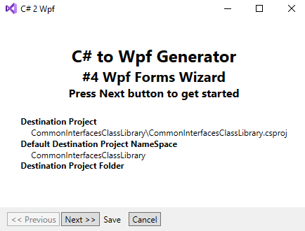

- Step 2
    - Select "DbContextClassLibrary"-project
    - Select "LitDbContext"-DbContext
    - Click "Next"-button

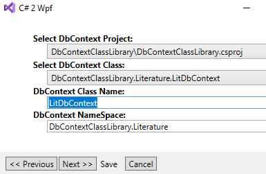

- Step 3
    - Select "==context==" in the combo
    - Click "Next"-button

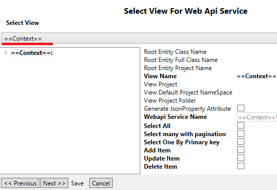

- Step 4
    - Click "batch processing"-button

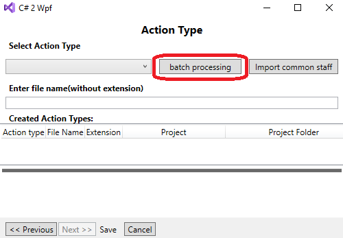

- Step 5
    - Select "00000-ContextLevelCommonInterfacesBatch.json"-item
    - Click "Start"-button
    - After generation finished make sure that "Error"-panel is empty
    - Close Wizard's dialogs
    - Rebuild "ModelInterfacesClassLibrary"-project

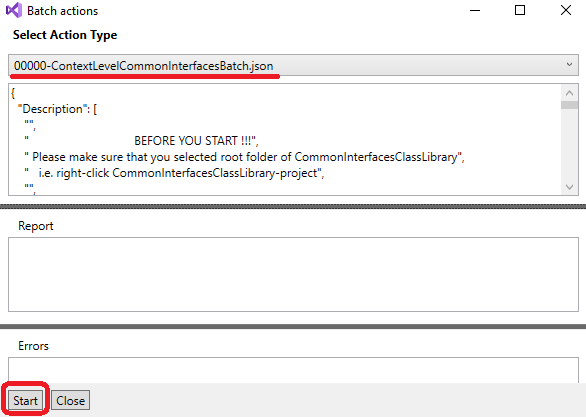

### "CommonServicesPrismModule"-project
- Repeat steps 1-5 for "CommonServicesPrismModule"-project and "00010-ContextLevelCommonServicesModuleBatch.json"

### "CommonWpfCustomControlLibrary"-project
- Repeat steps 1-5 for "CommonWpfCustomControlLibrary"-project and "00020-ContextLevelWpfCustomControlLibraryBatch.json"

### "CommonServicesPrismModule"-project again
- Repeat steps 1-5 for "CommonServicesPrismModule"-project and "00040-ContextLevelCommonServicesModuleBatch.json"

### "PrismTestApp"-project again
- Repeat steps 1-5 for "PrismTestApp"-project and "00050-ContextLevelPrismAppBatch.json"

## Setup Prism IMoule for CommonServicesPrismModule

Open the "CommonServicesPrismModuleModule.cs"-file of CommonServicesPrismModule-project and modify "RegisterTypes()"-method as follows
```java
...
using CommonInterfacesClassLibrary.AppGlblSettingsSrvc;
using CommonServicesPrismModule.AppGlblSettingsSrvc;
using CommonServicesPrismModule.CustomDlgWindows;
using CommonWpfUserControlLibrary.UserControls;
using CommonServicesPrismModule.ViewModels;
using CommonServicesPrismModule.UserControls;
using CommonInterfacesClassLibrary.AppGlblLoginSrvc;
using CommonServicesPrismModule.AppGlblLoginSrvc;

namespace CommonServicesPrismModule
{
    public class CommonServicesPrismModuleModule : IModule
    {
        ...
        public void RegisterTypes(IContainerRegistry containerRegistry)
        {
            IAppGlblSettingsService s = new AppGlblSettingsService();
            containerRegistry.RegisterInstance<IAppGlblSettingsService>(s);

            containerRegistry.RegisterDialogWindow<CustomDlgMediumWindow>();
            containerRegistry.RegisterDialogWindow<CustomDlgLargeWindow>("CustomDlgLargeWindow");
            containerRegistry.RegisterDialogWindow<CustomDlgMediumWindow>("CustomDlgMediumWindow");
            containerRegistry.RegisterDialogWindow<CustomDlgSmallWindow>("CustomDlgSmallWindow");

            containerRegistry.RegisterDialog<ColumnSelectorDlgUserControl, ColumnSelectorDlgViewModel>("ColumnSelectorDlg");
            containerRegistry.RegisterDialog<MessageDlgUserControl, MessageDlgViewModel>("MessageDlg");

            containerRegistry.RegisterForNavigation<HomeUserControl, HomeViewModel>("HomeUserControl");
            containerRegistry.RegisterForNavigation<PageNotFoundUserControl, PageNotFoundViewModel>("PageNotFoundUserControl");
            containerRegistry.RegisterForNavigation<AccessDeniedUserControl, AccessDeniedViewModel>("AccessDeniedUserControl");

            containerRegistry.Register<IAppGlblLoginService, AppGlblLoginService>();
            containerRegistry.RegisterForNavigation<RegisterUserControl, RegisterViewModel>("RegisterUserControl");
            containerRegistry.RegisterForNavigation<LoginUserControl, LoginViewModel>("LoginUserControl");
            containerRegistry.RegisterForNavigation<ChngpswdUserControl, ChngpswdViewModel>("ChngpswdUserControl");
            containerRegistry.RegisterForNavigation<LogoutUserControl, LogoutViewModel>("LogoutUserControl");
            
            ViewModelLocationProvider.Register<ScopedRegionNavigationUserControl, ScopedRegionNavigationViewModel>();
            containerRegistry.Register<IScopedRegionNavigationUserControlInterface, ScopedRegionNavigationUserControl>();
        }
    }
}
```
## Setup App.Config and App.xaml.cs for PrismTestApp
Open "App.xaml.cs"-file of PrismTestApp-project and add "CreateModuleCatalog()" and "ConfigureRegionAdapterMappings()" methods as follows
```java
...

using Prism.Regions;
using CommonWpfUserControlLibrary.UserControls;
using PrismTestApp.Classes;

namespace PrismTestApp
{
    public partial class App
    {
        ...
        protected override IModuleCatalog CreateModuleCatalog()
        {
            return new ConfigurationModuleCatalog();
        }
        protected override void ConfigureRegionAdapterMappings(RegionAdapterMappings regionAdapterMappings)
        {
            base.ConfigureRegionAdapterMappings(regionAdapterMappings);
            regionAdapterMappings.RegisterMapping<ProxyUserControl, ProxyUserControlRegionAdapter>();
            regionAdapterMappings.RegisterMapping<NavigationProxyUserControl, NavigationProxyUserControlRegionAdapter>();
        }
    }
}
```

Open "App.xaml"-file of PrismTestApp-project and modify as follows

```xml
<prism:PrismApplication x:Class="PrismTestApp.App"
             xmlns="http://schemas.microsoft.com/winfx/2006/xaml/presentation"
             xmlns:x="http://schemas.microsoft.com/winfx/2006/xaml"
	     xmlns:prism="http://prismlibrary.com/"
             xmlns:local="clr-namespace:PrismTestApp">
    <Application.Resources>
        <ResourceDictionary Source="pack://application:,,,/CommonWpfCustomControlLibrary;component/Themes/BasicResourceDictionary.xaml"/>
    </Application.Resources>
</prism:PrismApplication>
```

Add the "App.config"-file to PrismTestApp-project 

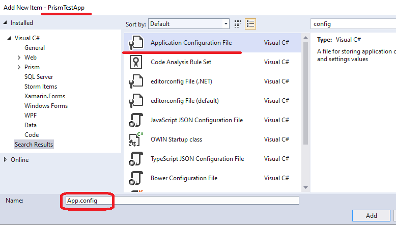

Modify "App.config"-file of PrismTestApp-project as follows:

```xml
<?xml version="1.0" encoding="utf-8" ?>
<configuration>
  <configSections>
    <section name="modules" type="Prism.Modularity.ModulesConfigurationSection, Prism.Wpf"/>
  </configSections>
  <modules>
    <module assemblyFile="CommonServicesPrismModule.dll"
            moduleType="CommonServicesPrismModule.CommonServicesPrismModuleModule, CommonServicesPrismModule, Version=1.0.0.0, Culture=neutral, PublicKeyToken=null"
            moduleName="CommonServicesPrismModule" startupLoaded="true">
      <dependencies>
      </dependencies>
    </module>
    <module assemblyFile="ModelServicesPrismModule.dll"
            moduleType="ModelServicesPrismModule.ModelServicesModuleModule, ModelServicesPrismModuleModule, Version=1.0.0.0, Culture=neutral, PublicKeyToken=null"
            moduleName="ModelServicesPrismModule" startupLoaded="true">
      <dependencies>
        <dependency moduleName="CommonServicesPrismModule"/>
      </dependencies>
    </module>
  </modules>
</configuration>
```
## Run PrismTestApp
Rebuild all front end  projects and run PrismTestApp.

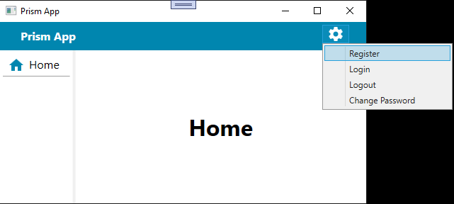

Click "Register"-menu item. Click "Home"-navigation menu again.

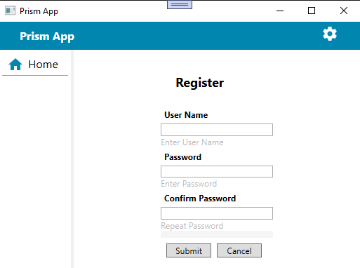

## Setup CommonServicesPrismModule and DbWebApplication projects for conversation
Click DbWebApplication root node to get project properties visible. Copy SSL URL into clipboard.


Open "CommonServicesPrismModule/AppGlblSettingsSrvc/AppGlblSettingsService.cs"-file of the CommonServicesPrismModule-project. Modify GetWebApiPrefix() and GetSecurityWebApiPrefix() by resetting URLs.

```java
        ...
        public string GetWebApiPrefix(string ViewName)
        {
            string rslt = "";
            if(!string.IsNullOrEmpty(ViewName))
            {
                rslt = "https://localhost:44352/";
            }
            return rslt;
        }
        public string GetSecurityWebApiPrefix()
        {
            return "https://localhost:44352/";
        }
        ...
```

Install MS SQL Server anywhere in your network or virtual environment. Get "sa"-password, network name of the SQL server and the port (if necessary).
Open Web.config-file of DbWebApplication-project and modify "DefaultConnection"-settings. Here is example:

```xml
  ... 
  <connectionStrings>
    <add name="DefaultConnection" 
        connectionString="Data Source=SVR2016SQL2017;Initial Catalog=AspNetDbWebApplicationSecurity;Persist Security Info=True;User ID=sa;Password=sa_PASSWORD_HERE" 
        providerName="System.Data.SqlClient" />
  </connectionStrings>
  ... 
```
Note: You will have different "Data Source"-property in your development invoronment.

The front and back ends are ready to register user, login, logout, change password operations. 
- Rebuild CommonServicesPrismModule-project
- Run DbWebApplication 
- Run PrismTestApp

With PrismTestApp Register new user: "testuser@gmail.com" with a password "Qq?1234". Open MS SQL Management studion and run the script

```java
SELECT * FROM [AspNetDbWebApplicationSecurity].[dbo].[AspNetUsers]
```
The result is on the picture below

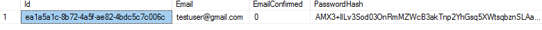

For now Login with PrismTestApp and "testuser@gmail.com" and password "Qq?1234". The result is on the picture below


## Types of generated Wpf user controls for the given View
Here is a list of Wpf custom user controls the developer may generate for the given View
- Sform
    - Sform is a search user control. With Sform the user can define filter, sort order and pagination capability. Sorting, filtering and pagination are sent to the Web server. Sform just shows the result.
- Eform
    - Eform is an edit user control. With Eform the user can add, update and delete data.
- Lform
    - Lform is a user control that combines Sform and Eform together. With Lform the user can search and modify the data for the given View. For add, update, delete operation the modal dialog with Eform as a child is shown.
- Redit
    - Redit is a navigation awair Eform
- Rlist
    - Rlist is a navigation awair Sform.
- Rdlist
    - Rdlist is a navigation awair Lform.
- O2m
    - O2m is master-detail or One-to-many form. If the Database Entity of the given View has detail Database Entity then O2m will be useful.

For each type of the wpf user controls three files are generated:
- xaml of the user control
- xaml.cs or code behind of the the user control
- Mvvm ViewModel file

For the Sform, Eform, Lform types of user control CS2WPF Wizard generates Dialog wrappers. 
It means three additional files will be created:
- XXXEdlgUserControl.xaml
- XXXEdlgUserControl.xaml.cs 
- XXXEdlgViewModel.cs

The developer can remove Dialog wrappers for the Eform and Lform. But do not delete dialog wrapper for the Sform, since dialog wrapper for the Sform is used by Eform user controls. Again if Lform is going to be used by the application then Dialog wrapper for Eform should be generated as well.

All controls above send(receive) data to(from) the Web server with ApiService which should be generated for the given View at the client side of the solution. 
It's very important to note, that the client side of the solution does not reference any file of the server side of the solution.

- From the structural point of view 
    - Wpf Lform is a parent of Wpf Sform 
    - Wpf Redit is a parent of Wpf Eform 
    - Wpf Rlist is a parent of Wpf Sform
    - Wpf Rdlist is a parent of Wpf Lform
    - Wpf O2m is a parent of Wpf Lform for master View and all delail Views

Again it's very important to note, that any pair of parent and child controls can be hosted in separate Prism modules. 
If the CS2WPF Wizard detects the fact that parent and child user controls reside in separate Prism modules it generates XAML for the parent with "ProxyUserControl" instead of the child user control. 
Of course it requires additional line of code in the IModule implementation class of the child Prism module.
This is because "ProxyUserControl" uses Prism View discovery, so child control must be registered with a Prism region.  The name of the Prism region is defined by XAML of the parent user control. 

In any case, the developer shouldn't worry about this fact. After generating any user control the develiper must open the file of the ViewModel and follow the instruction at the begining of the file.
CS2WPF Wizard writes instruction about what to insert and in which file of IModule implementation class.

Let's talk about "ProxyUserControl" and Prism View discovery. Sometimes you need to show two or more copies of the same user control on the application page or window. For instance, two different O2m user controls has the same detail View. CS2WPF Wizard does not generate unique Prism region names of detail Views for each new O2m user control!!! And not because it's very difficult, but because it will require a big list of the registrations of the same control with different Prism region names. What it means at the end?  It means that we can get region conflicting exceptions at execution time. The question is how to avoid possible conflicting exceptions in the future.

The CS2WPF Feature Wizard solves this problem. CS2WPF Feature Wizard generates the controls which injects each child controls into separate Scoped region. 

```java
                UserControl uc = _containerProvider.Resolve<UserControl>("LitGenreViewO2mUserControl");
                IRegionManager rm = _regionManager.Regions["LitGenreViewO2mUserControlGenreFeatureFtrUserControl"].Add(uc, null, true);
                _regionManager.Regions["LitGenreViewO2mUserControlGenreFeatureFtrUserControl"].Activate(uc);
                // where _regionManager is injected by the constructor of the Feature ViewModel
```
It's very good practice to use Feature wrapper for any generated user control. Note that Feature wrapper can have more than one child user control. Child user control of the Feature wrapper can be navigation awair control (like Rlist) or not (like Lform). Feature wrapper can have any number of navigation awair controls, i.e. the end user can have the form with two or more independent navigation child windows inside.

## Modeling UI and generating Lform Wpf User controls for LitGenre.

In both projects ModelServicesPrismModule and ModelInterfacesClassLibrary create "Literature/LitGenre"-folder.

Right click "Literature/LitGenre"-folder of the ModelInterfacesClassLibrary-project and choose "Wpf Form Wizard"-menu item.

- Step 1: On the first page of the Wizard click "Next"-button. On the second page select "DbContextClassLibrary"-project and "LitDbContext"-DbContext. click "Next"-button.

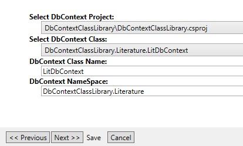

- Step 2: On the second page choose LitGenreView expand "UI list properties" and check "Shown"-checkboxes

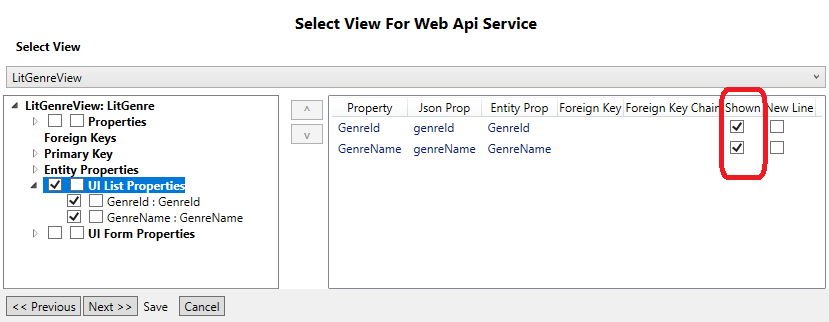

- Step 3: On the third page choose LitGenreView expand "UI Form properties", check "Shown"-checkboxes and set "Input types" as it is shown below. Click Next button.

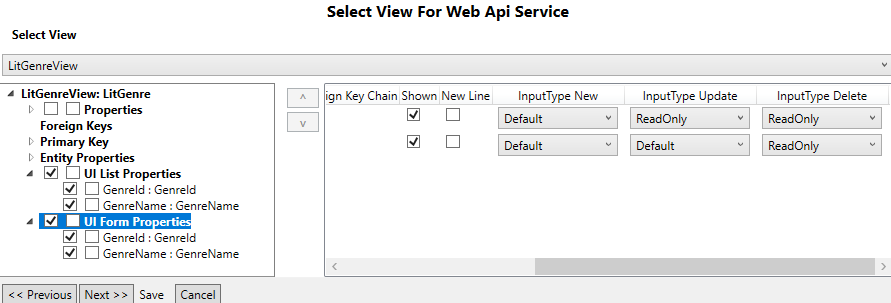

- Step 4: On the fourth page "batch processing"-button and "Batch actions"-dialog will be shown. Select "0110-Interfaces.json"-script and click "start"-button.

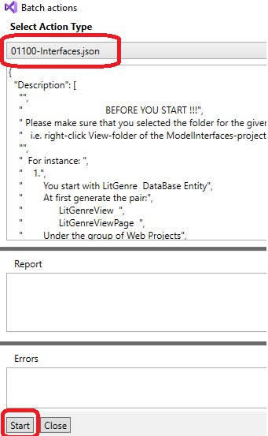

- Step 5: Make sure that "Errors"-panel is empty and you got the following list of files:

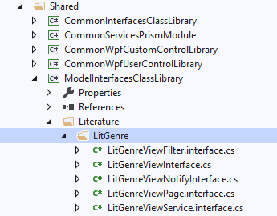


Right click "Literature/LitGenre"-folder of the ModelServicesPrismModule-project and choose "Wpf Form Wizard"-menu item.

Repeat steps 1-4 for "DbContextClassLibrary"-project and "LitDbContext"-DbContext and "01400-ApiService.json"-batch script. Note: steps 2 and 3 need to be accomplished only very first time. Next time they are ready to be used, since all settings are written into repository file.

Repeat steps 1-4 for "DbContextClassLibrary"-project and "LitDbContext"-DbContext and "01420-SForm.json"-batch script. Note: steps 2 and 3 need to be accomplished only very first time. Next time they are ready to be used, since all settings are written into repository file.

The result should be as shown below

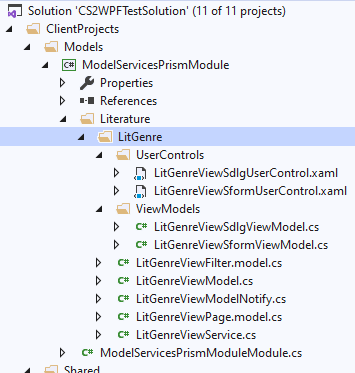

Open "Literature/LitGenre/LitGenreViewService.cs"-file of the ModelServicesPrismModule-project and follow the instruction at the begining of the file

```java
...
using CommonInterfacesClassLibrary.AppGlblSettingsSrvc;

/*
    In the file of IModule-class of the project for the current service the following lines of code must be inserted:

        public void RegisterTypes(IContainerRegistry containerRegistry)
        {
            ...
            containerRegistry.Register<ILitGenreViewService, LitGenreViewService>();
            ...
        }

*/
namespace ModelServicesPrismModule.Literature.LitGenre {
...    
```
According to the requirements above "RegisterTypes()"-method of the ModelServicesPrismModuleModule.cs should have a line of code
```java
...
namespace ModelServicesPrismModule
{
    public class ModelServicesPrismModuleModule : IModule
    {
        ...
        public void RegisterTypes(IContainerRegistry containerRegistry)
        {
            ...
            containerRegistry.Register<ILitGenreViewService, LitGenreViewService>();
            ...
        }
        ...    
    }
}
```
Open "Literature/LitGenre/LitGenreViewSformViewModel.cs"-file of the ModelServicesPrismModule-project and follow the instruction at the begining of the file

```java
...
/*

    "LitGenreViewSformUserControl" UserControl is defined in the "ModelServicesPrismModule"-project.
    In the file of IModule-class of "ModelServicesPrismModule"-project the following line of code must be inserted:

        public void RegisterTypes(IContainerRegistry containerRegistry)
        {
            ...
            // According to requirements of the "LitGenreViewSformViewModel.cs"-file of "ModelServicesPrismModule"-project. 
            ViewModelLocationProvider.Register<LitGenreViewSformUserControl, LitGenreViewSformViewModel>();
            // According to requirements of the "LitGenreViewSformViewModel.cs"-file of "ModelServicesPrismModule"-project. 
            containerRegistry.Register<UserControl, LitGenreViewSformUserControl>("LitGenreViewSformUserControl");
            ...
        }

*/
...
```

Open "Literature/LitGenre/LitGenreViewSdlgViewModel.cs"-file of the ModelServicesPrismModule-project and follow the instruction at the begining of the file

```java
...
/*

    "LitGenreViewSdlgUserControl" UserControl is defined in the "ModelServicesPrismModule"-project.
    In the file of IModule-class of "ModelServicesPrismModule"-project the following line of code must be inserted:

        public void RegisterTypes(IContainerRegistry containerRegistry)
        {
            ...
            // According to requirements of the "LitGenreViewSdlgViewModel.cs"-file of "ModelServicesPrismModule"-project. 
            containerRegistry.RegisterDialog<LitGenreViewSdlgUserControl, LitGenreViewSdlgViewModel>("LitGenreViewSdlgViewModel");
            ...
        }

*/
...
```

According to the requirements above "RegisterTypes()"-method of the ModelServicesPrismModuleModule.cs will be as follows

```java
...
namespace ModelServicesPrismModule
{
    public class ModelServicesPrismModuleModule : IModule
    {
        ...
        public void RegisterTypes(IContainerRegistry containerRegistry)
        {
            ...
            containerRegistry.Register<ILitGenreViewService, LitGenreViewService>();
            // According to requirements of the "LitGenreViewSformViewModel.cs"-file of "ModelServicesPrismModule"-project. 
            ViewModelLocationProvider.Register<LitGenreViewSformUserControl, LitGenreViewSformViewModel>();
            // According to requirements of the "LitGenreViewSformViewModel.cs"-file of "ModelServicesPrismModule"-project. 
            containerRegistry.Register<UserControl, LitGenreViewSformUserControl>("LitGenreViewSformUserControl");
            // According to requirements of the "LitGenreViewSdlgViewModel.cs"-file of "ModelServicesPrismModule"-project. 
            containerRegistry.RegisterDialog<LitGenreViewSdlgUserControl, LitGenreViewSdlgViewModel>("LitGenreViewSdlgViewModel");
            ...
        }
        ...    
    }
}
```

Repeat steps 1-4 for "DbContextClassLibrary"-project, "LitDbContext"-DbContext, "LitGenre"-View and "01500-Eform.json"-batch script. Note: steps 2 and 3 need to be accomplished only very first time. Next time they are ready to be used, since all settings are written into repository file.

Open "Literature/LitGenre/LitGenreViewEformViewModel.cs"-file of the ModelServicesPrismModule-project and follow the instruction at the begining of the file

```java
/*
    "LitGenreViewEformUserControl" UserControl is defined in the "ModelServicesPrismModule"-project.
    In the file of IModule-class of "ModelServicesPrismModule"-project the following line of code must be inserted:

        public void RegisterTypes(IContainerRegistry containerRegistry)
        {
            ...
            // According to requirements of the "LitGenreViewEformViewModel.cs"-file of "ModelServicesPrismModule"-project. 
            ViewModelLocationProvider.Register<LitGenreViewEformUserControl, LitGenreViewEformViewModel>();
            // According to requirements of the "LitGenreViewEformViewModel.cs"-file of "ModelServicesPrismModule"-project. 
            containerRegistry.Register<UserControl, LitGenreViewEformUserControl>("LitGenreViewEformUserControl");
            ...
        }
*/
```
Open "Literature/LitGenre/LitGenreViewEdlgViewModel.cs"-file of the ModelServicesPrismModule-project and follow the instruction at the begining of the file
```java
/*
    "LitGenreViewEdlgUserControl" UserControl is defined in the "ModelServicesPrismModule"-project.
    In the file of IModule-class of "ModelServicesPrismModule"-project the following line of code must be inserted:

        public void RegisterTypes(IContainerRegistry containerRegistry)
        {
            ...
            // According to requirements of the "LitGenreViewEdlgViewModel.cs"-file of "ModelServicesPrismModule"-project. 
            containerRegistry.RegisterDialog<LitGenreViewEdlgUserControl, LitGenreViewEdlgViewModel>("LitGenreViewEdlgViewModel");
            ...
        }
*/
```

Repeat steps 1-4 for "DbContextClassLibrary"-project, "LitDbContext"-DbContext, "LitGenre"-View and "01600-Lform.json"-batch script. Note: steps 2 and 3 need to be accomplished only very first time. Next time they are ready to be used, since all settings are written into repository file.

Open "Literature/LitGenre/LitGenreViewLformViewModel.cs"-file of the ModelServicesPrismModule-project and follow the instruction at the begining of the file
```java
/*
        public void RegisterTypes(IContainerRegistry containerRegistry)
        {
            ...
            // According to requirements of the "LitGenreViewLformViewModel.cs"-file of "ModelServicesPrismModule"-project. 
            ViewModelLocationProvider.Register<LitGenreViewLformUserControl, LitGenreViewLformViewModel>();
            // According to requirements of the "LitGenreViewLformViewModel.cs"-file of "ModelServicesPrismModule"-project. 
            containerRegistry.Register<UserControl, LitGenreViewLformUserControl>("LitGenreViewLformUserControl");
            ...
        }
*/
```

Open "Literature/LitGenre/LitGenreViewLdlgViewModel.cs"-file of the ModelServicesPrismModule-project and follow the instruction at the begining of the file
```java
/*
    "LitGenreViewLdlgUserControl" UserControl is defined in the "ModelServicesPrismModule"-project.
    In the file of IModule-class of "ModelServicesPrismModule"-project the following line of code must be inserted:

        public void RegisterTypes(IContainerRegistry containerRegistry)
        {
            ...
            // According to requirements of the "LitGenreViewLdlgViewModel.cs"-file of "ModelServicesPrismModule"-project. 
            containerRegistry.RegisterDialog<LitGenreViewLdlgUserControl, LitGenreViewLdlgViewModel>("LitGenreViewLdlgViewModel");
            ...
        }
*/
```

## Creating LiteratureTest Database on the server side.
- Step 1: Open "Literature\LitDbContext.cs" file of DbContextClassLibrary-project.
- Step 2: Change the body of thee default contructor
```java
        public LitDbContext(): base("name=LiteratureTestConnection")
        {
        }
```
- Step 3: Open "Web.config"-file of  DbWebApplication-project.
- Step 4: Change "connectionStrings"-sction
```xml
  ... 
  <connectionStrings>
    <add name="DefaultConnection" 
        connectionString="Data Source=SVR2016SQL2017;Initial Catalog=AspNetDbWebApplicationSecurity;Persist Security Info=True;User ID=sa;Password=sa_PASSWORD_HERE" 
        providerName="System.Data.SqlClient" />
    <add name="LiteratureTestConnection" 
        connectionString="Data Source=SVR2016SQL2017;Initial Catalog=LiteratureTestCatalog;Persist Security Info=True;User ID=sa;Password=sa_PASSWORD_HERE"
        providerName="System.Data.SqlClient" />
  </connectionStrings>
  ... 
```
Note: You will have different "Data Source"-property in your development invoronment.

- Step 5: Add to solution small Console application (Net Framework).
- step 6: For the console application add reference to "DbContextClassLibrary"-project, "DbEntitiesClassLibrary"-project and "Entity Framework 6 (EF6)" nuget package
- Step 7: Open "App.config" file of the Console application
- Step 8: Add "connectionStrings" sections into "App.config" and save
```xml
...
  <configSections>
        <!-- For more information on Entity Framework configuration, visit http://go.microsoft.com/fwlink/?LinkID=237468 -->
        <section name="entityFramework"
          type="System.Data.Entity.Internal.ConfigFile.EntityFrameworkSection, EntityFramework, Version=6.0.0.0, Culture=neutral, PublicKeyToken=b77a5c561934e089"
          requirePermission="false"/>
  </configSections>
...  
  <connectionStrings>
    <add name="LiteratureTestConnection"
        connectionString="Data Source=SVR2016SQL2017;Initial Catalog=LiteratureTestCatalog;Persist Security Info=True;User ID=sa;Password=sa_PASSWORD_HERE"
        providerName="System.Data.SqlClient" />
  </connectionStrings>
...  
  <startup> 
        <supportedRuntime version="v4.0" sku=".NETFramework,Version=v4.7.2"/>
    </startup>
    <entityFramework>
        <providers>
            <provider invariantName="System.Data.SqlClient" type="System.Data.Entity.SqlServer.SqlProviderServices, EntityFramework.SqlServer"/>
        </providers>
    </entityFramework>
...  
```
Note: You will have different "Data Source"-property in your development invoronment.

- step 9: In the main method of the Console application write the code as below
```java
        static void Main(string[] args)
        {
            Database.SetInitializer(new DropCreateDatabaseAlways<LitDbContext>());
            LitDbContext db = new LitDbContext();
            db.LitGenreDbSet.FirstOrDefault();
            Database.SetInitializer(new CreateDatabaseIfNotExists<LitDbContext>());
        }
```
- step 9: Save, build and run Console application.
- step 10: Open MS SQL Management studion and check the list of the databases. "LiteratureTestCatalog"-database should be created with one "dbo.LitGenres"-table.

## Add LitGenreViewLformUserControl to navigation list.
- Step 1: Open "ModelServicesPrismModuleModule.cs"-file of the ModelServicesPrismModule-project
- Step 2: Modify RegisterTypes()-method as shown
```java
        public void RegisterTypes(IContainerRegistry containerRegistry)
        {
            containerRegistry.Register<ILitGenreViewService, LitGenreViewService>();
            // According to requirements of the "LitGenreViewSformViewModel.cs"-file of "ModelServicesPrismModule"-project. 
            ViewModelLocationProvider.Register<LitGenreViewSformUserControl, LitGenreViewSformViewModel>();
            // According to requirements of the "LitGenreViewSformViewModel.cs"-file of "ModelServicesPrismModule"-project. 
            containerRegistry.Register<UserControl, LitGenreViewSformUserControl>("LitGenreViewSformUserControl");
            // According to requirements of the "LitGenreViewSdlgViewModel.cs"-file of "ModelServicesPrismModule"-project. 
            containerRegistry.RegisterDialog<LitGenreViewSdlgUserControl, LitGenreViewSdlgViewModel>("LitGenreViewSdlgViewModel");
            // According to requirements of the "LitGenreViewEformViewModel.cs"-file of "ModelServicesPrismModule"-project. 
            ViewModelLocationProvider.Register<LitGenreViewEformUserControl, LitGenreViewEformViewModel>();
            // According to requirements of the "LitGenreViewEformViewModel.cs"-file of "ModelServicesPrismModule"-project. 
            containerRegistry.Register<UserControl, LitGenreViewEformUserControl>("LitGenreViewEformUserControl");
            // According to requirements of the "LitGenreViewEdlgViewModel.cs"-file of "ModelServicesPrismModule"-project. 
            containerRegistry.RegisterDialog<LitGenreViewEdlgUserControl, LitGenreViewEdlgViewModel>("LitGenreViewEdlgViewModel");
            // According to requirements of the "LitGenreViewLformViewModel.cs"-file of "ModelServicesPrismModule"-project. 
            ViewModelLocationProvider.Register<LitGenreViewLformUserControl, LitGenreViewLformViewModel>();
            // According to requirements of the "LitGenreViewLformViewModel.cs"-file of "ModelServicesPrismModule"-project. 
            containerRegistry.Register<UserControl, LitGenreViewLformUserControl>("LitGenreViewLformUserControl");
            // According to requirements of the "LitGenreViewLdlgViewModel.cs"-file of "ModelServicesPrismModule"-project. 
            containerRegistry.RegisterDialog<LitGenreViewLdlgUserControl, LitGenreViewLdlgViewModel>("LitGenreViewLdlgViewModel");

            // temporaty declaration for test only
            containerRegistry.RegisterForNavigation<LitGenreViewLformUserControl, LitGenreViewLformViewModel>("LitGenreViewLformUserControl");
        }
```
- Step 3: Save all and rebuild ModelServicesPrismModule-project
- Step 4: Open "ViewModels\MainWindowViewModel.cs"-file of the PrismTestApp-project
- Step 5: Modify _MainMenu variable as shown
```java
        IEnumerable<IWebServiceFilterMenuInterface> _MainMenu = new ObservableCollection<IWebServiceFilterMenuInterface>()
        {
            new WebServiceFilterMenuViewModel() { Id = "000", Caption="Home", IconName="Home",  IconColor="Primary", Data="HomeUserControl", Command=RoutedCommandExt.MainMenuCommand},
            new WebServiceFilterMenuViewModel() { Id = "001", Caption="LitGenre Lform", IconName="TableRefresh",  IconColor="Primary", Data="LitGenreViewLformUserControl", Command=RoutedCommandExt.MainMenuCommand},
        };
```
## Test LitGenreViewLformUserControl control
1. Rebuild ModelServicesPrismModule-project 
2. Run DbWebApplication (server side)
3. Run PrismTestApp (client side)
4. Click "LitGenre Lform"-navigation menu
5. Check if Add, Update and Delete operation are available.
    - Right click any row and select Update or Delete menu item
6. Check if sorting and filtering  are available.

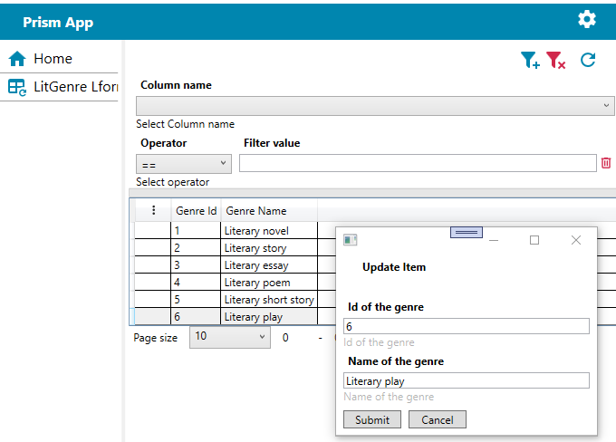

## Generating Redit and Rlist Wpf User controls for LitGenre


Right click "Literature/LitGenre"-folder of the ModelInterfacesClassLibrary-project and choose "Wpf Form Wizard"-menu item.

- Step 1: On the first page of the Wizard click "Next"-button. On the second page select "DbContextClassLibrary"-project and "LitDbContext"-DbContext. click "Next"-button.


- Step 2: On the second page choose LitGenreView expand "UI list properties" and check "Shown"-checkboxes


- Step 3: On the third page choose LitGenreView expand "UI Form properties", check "Shown"-checkboxes and set "Input types" as it is shown below. Click Next button.


- Step 4: On the fourth page "batch processing"-button and "Batch actions"-dialog will be shown. Select "01820-Redit.json"-script and click "start"-button.

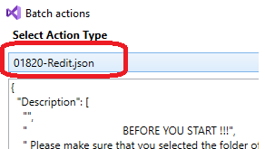

- Step 5: Make sure that "Errors"-panel is empty.

- Step 6: Repeat steps 4 and 5 for 01920-Rlist.json.

## Modify Prism IModule class
- Step 1: Open "Literature\LitGenre\ViewModels\LitGenreViewReditViewModel.cs" file of "ModelServicesPrismModule" project and follow the instructions
```java
/*
    "LitGenreViewReditUserControl" UserControl is defined in the "ModelServicesPrismModule"-project.
    In the file of IModule-class of "ModelServicesPrismModule"-project the following line of code must be inserted:

        public void RegisterTypes(IContainerRegistry containerRegistry)
        {
            ...
            // According to requirements of the "LitGenreViewReditViewModel.cs"-file of "ModelServicesPrismModule"-project. 
            ViewModelLocationProvider.Register<LitGenreViewReditUserControl, LitGenreViewReditViewModel>();
            // According to requirements of the "LitGenreViewReditViewModel.cs"-file of "ModelServicesPrismModule"-project. 
            containerRegistry.RegisterForNavigation<LitGenreViewReditUserControl, LitGenreViewReditViewModel>("LitGenreViewReditUserControl");
            // According to requirements of the "LitGenreViewReditViewModel.cs"-file of "ModelServicesPrismModule"-project. 
            containerRegistry.Register<UserControl, LitGenreViewReditUserControl>("LitGenreViewReditUserControl");
            ...
        }
*/
```
- Step 2: Open "Literature\LitGenre\ViewModels\LitGenreViewRlistViewModel.cs" file of "ModelServicesPrismModule" project and follow the instructions
```java
/*
    "LitGenreViewRlistUserControl" UserControl is defined in the "ModelServicesPrismModule"-project.
    In the file of IModule-class of "ModelServicesPrismModule"-project the following line of code must be inserted:

        public void RegisterTypes(IContainerRegistry containerRegistry)
        {
            ...
            // According to requirements of the "LitGenreViewRlistViewModel.cs"-file of "ModelServicesPrismModule"-project. 
            ViewModelLocationProvider.Register<LitGenreViewRlistUserControl, LitGenreViewRlistViewModel>();
            // According to requirements of the "LitGenreViewRlistViewModel.cs"-file of "ModelServicesPrismModule"-project. 
            containerRegistry.RegisterForNavigation<LitGenreViewRlistUserControl, LitGenreViewRlistViewModel>("LitGenreViewRlistUserControl");
            // According to requirements of the "LitGenreViewRlistViewModel.cs"-file of "ModelServicesPrismModule"-project. 
            containerRegistry.Register<UserControl, LitGenreViewRlistUserControl>("LitGenreViewRlistUserControl");
            ...
        }
*/
```

- Step 3: Open ModelServicesPrismModuleModule.cs file of ModelServicesPrismModule project and make the modification according to the requirements above.

## Modify main menu of MainWindowViewModel and run app
- Step 1: Open "ViewModels\MainWindowViewModel.cs" file of "PrismTestApp" project and add "LitGenre RList"-menu item.
```java
        IEnumerable<IWebServiceFilterMenuInterface> _MainMenu = new ObservableCollection<IWebServiceFilterMenuInterface>()
        {
            new WebServiceFilterMenuViewModel() { Id = "000", Caption="Home", IconName="Home",  IconColor="Primary", Data="HomeUserControl", Command=RoutedCommandExt.MainMenuCommand},
            new WebServiceFilterMenuViewModel() { Id = "001", Caption="LitGenre Lform", IconName="TableRefresh",  IconColor="Primary", Data="LitGenreViewLformUserControl", Command=RoutedCommandExt.MainMenuCommand},
            new WebServiceFilterMenuViewModel() { Id = "001", Caption="LitGenre RList", IconName="TableRefresh",  IconColor="Primary", Data="LitGenreViewRlistUserControl", Command=RoutedCommandExt.MainMenuCommand},
        };
```
- Step 2: Rebuild "ModelServicesPrismModule" project, 
- Step 3: Run DbWebApplication 
- Step 4: Run PrismTestApp
- Step 5: Click "LitGenre RList"-navigation menu. Select any row in the grid and right click and choose "Update"-menu item

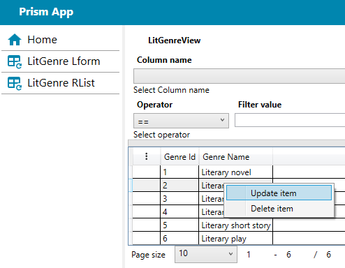

- Step 6: Click "Submit" or "Cancel" button to navigate back to "Rlist"-form

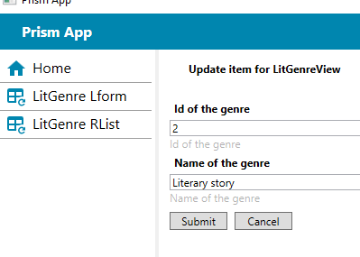

## Generating Rdlist Wpf User control for LitGenre

Right click "Literature/LitGenre"-folder of the ModelInterfacesClassLibrary-project and choose "Wpf Form Wizard"-menu item.

- Step 1: On the first page of the Wizard click "Next"-button. On the second page select "DbContextClassLibrary"-project and "LitDbContext"-DbContext. click "Next"-button.


- Step 2: On the second page choose LitGenreView expand "UI list properties" and check "Shown"-checkboxes


- Step 3: On the third page choose LitGenreView expand "UI Form properties", check "Shown"-checkboxes and set "Input types" as it is shown below. Click Next button.


- Step 4: On the fourth page "batch processing"-button and "Batch actions"-dialog will be shown. Select "02020-Rdlist.json"-script and click "start"-button.

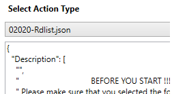

- Step 5: Make sure that "Errors"-panel is empty.

## Modify Prism IModule class for Rdlist
- Step 1: Open "Literature\LitGenre\ViewModels\LitGenreViewRdlistViewModel.cs" file of "ModelServicesPrismModule" project and follow the instructions
```java
/*
    "LitGenreViewRdlistUserControl" UserControl is defined in the "ModelServicesPrismModule"-project.
    In the file of IModule-class of "ModelServicesPrismModule"-project the following line of code must be inserted:

        public void RegisterTypes(IContainerRegistry containerRegistry)
        {
            ...
            // According to requirements of the "LitGenreViewRdlistViewModel.cs"-file of "ModelServicesPrismModule"-project. 
            ViewModelLocationProvider.Register<LitGenreViewRdlistUserControl, LitGenreViewRdlistViewModel>();
            // According to requirements of the "LitGenreViewRdlistViewModel.cs"-file of "ModelServicesPrismModule"-project. 
            containerRegistry.RegisterForNavigation<LitGenreViewRdlistUserControl, LitGenreViewRdlistViewModel>("LitGenreViewRdlistUserControl");
            // According to requirements of the "LitGenreViewRdlistViewModel.cs"-file of "ModelServicesPrismModule"-project. 
            containerRegistry.Register<UserControl, LitGenreViewRdlistUserControl>("LitGenreViewRdlistUserControl");
            ...
        }
*/
```

## Modify main menu of MainWindowViewModel and run app
- Step 1: Open "ViewModels\MainWindowViewModel.cs" file of "PrismTestApp" project and add "LitGenre RdList"-menu item.
```java
        IEnumerable<IWebServiceFilterMenuInterface> _MainMenu = new ObservableCollection<IWebServiceFilterMenuInterface>()
        {
            new WebServiceFilterMenuViewModel() { Id = "000", Caption="Home", IconName="Home",  IconColor="Primary", Data="HomeUserControl", Command=RoutedCommandExt.MainMenuCommand},
            new WebServiceFilterMenuViewModel() { Id = "001", Caption="LitGenre Lform", IconName="TableRefresh",  IconColor="Primary", Data="LitGenreViewLformUserControl", Command=RoutedCommandExt.MainMenuCommand},
            new WebServiceFilterMenuViewModel() { Id = "001", Caption="LitGenre RList", IconName="TableRefresh",  IconColor="Primary", Data="LitGenreViewRlistUserControl", Command=RoutedCommandExt.MainMenuCommand},
            new WebServiceFilterMenuViewModel() { Id = "001", Caption="LitGenre RdList", IconName="TableRefresh",  IconColor="Primary", Data="LitGenreViewRdlistUserControl", Command=RoutedCommandExt.MainMenuCommand},
        };
```
- Step 2: Rebuild "ModelServicesPrismModule" project, 
- Step 3: Run DbWebApplication 
- Step 4: Run PrismTestApp
- Step 5: Click "LitGenre RList"-navigation menu. Select any row in the grid, click "DotsVertical"-button and choose "Add item"-menu item

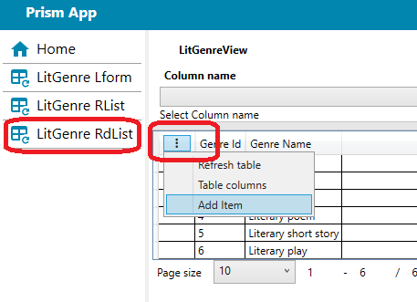

- Step 6: Make sure that add item dialog will be shown

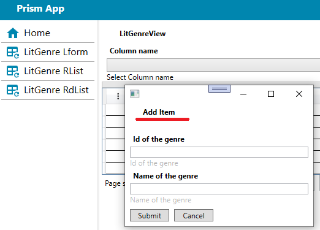

## Generating O2m Wpf User control for LitGenre

Right click "Literature/LitGenre"-folder of the ModelInterfacesClassLibrary-project and choose "Wpf Form Wizard"-menu item.

- Step 1: On the first page of the Wizard click "Next"-button. On the second page select "DbContextClassLibrary"-project and "LitDbContext"-DbContext. click "Next"-button.


- Step 2: On the second page choose LitGenreView expand "UI list properties" and check "Shown"-checkboxes


- Step 3: On the third page choose LitGenreView expand "UI Form properties", check "Shown"-checkboxes and set "Input types" as it is shown below. Click Next button.


- Step 4: On the fourth page "batch processing"-button and "Batch actions"-dialog will be shown. Select "01700-O2m.json"-script and click "start"-button.

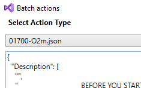

- Step 5: Make sure that "Errors"-panel is empty.

## Modify Prism IModule class for O2m
- Step 1: Open "Literature\LitGenre\ViewModels\LitGenreViewO2mViewModel.cs" file of "ModelServicesPrismModule" project and follow the instructions
```java
/*
    "LitGenreViewRdlistUserControl" UserControl is defined in the "ModelServicesPrismModule"-project.
    In the file of IModule-class of "ModelServicesPrismModule"-project the following line of code must be inserted:

        public void RegisterTypes(IContainerRegistry containerRegistry)
        {
            ...
            // According to requirements of the "LitGenreViewO2mViewModel.cs"-file of "ModelServicesPrismModule"-project. 
            ViewModelLocationProvider.Register<LitGenreViewO2mUserControl, LitGenreViewO2mViewModel>();
            // According to requirements of the "LitGenreViewO2mViewModel.cs"-file of "ModelServicesPrismModule"-project. 
            containerRegistry.Register<UserControl, LitGenreViewO2mUserControl>("LitGenreViewO2mUserControl");
            // According to requirements of the "LitGenreViewO2mViewModel.cs"-file of "ModelServicesPrismModule"-project. 
            containerRegistry.RegisterForNavigation<LitGenreViewO2mUserControl, LitGenreViewO2mViewModel>("LitGenreViewO2mUserControl");
            ...
        }
*/
```

## Modify main menu of MainWindowViewModel and run app for O2m
- Step 1: Open "ViewModels\MainWindowViewModel.cs" file of "PrismTestApp" project and add "LitGenre O2m"-menu item.
```java
        IEnumerable<IWebServiceFilterMenuInterface> _MainMenu = new ObservableCollection<IWebServiceFilterMenuInterface>()
        {
            new WebServiceFilterMenuViewModel() { Id = "000", Caption="Home", IconName="Home",  IconColor="Primary", Data="HomeUserControl", Command=RoutedCommandExt.MainMenuCommand},
            new WebServiceFilterMenuViewModel() { Id = "001", Caption="LitGenre Lform", IconName="TableRefresh",  IconColor="Primary", Data="LitGenreViewLformUserControl", Command=RoutedCommandExt.MainMenuCommand},
            new WebServiceFilterMenuViewModel() { Id = "001", Caption="LitGenre RList", IconName="TableRefresh",  IconColor="Primary", Data="LitGenreViewRlistUserControl", Command=RoutedCommandExt.MainMenuCommand},
            new WebServiceFilterMenuViewModel() { Id = "001", Caption="LitGenre RdList", IconName="TableRefresh",  IconColor="Primary", Data="LitGenreViewRdlistUserControl", Command=RoutedCommandExt.MainMenuCommand},
            new WebServiceFilterMenuViewModel() { Id = "001", Caption="LitGenre O2m", IconName="TableRefresh",  IconColor="Primary", Data="LitGenreViewO2mUserControl", Command=RoutedCommandExt.MainMenuCommand},
        };
```
- Step 2: Rebuild "ModelServicesPrismModule" project, 
- Step 3: Run DbWebApplication 
- Step 4: Run PrismTestApp
- Step 5: Click "LitGenre O2m"-navigation menu. 

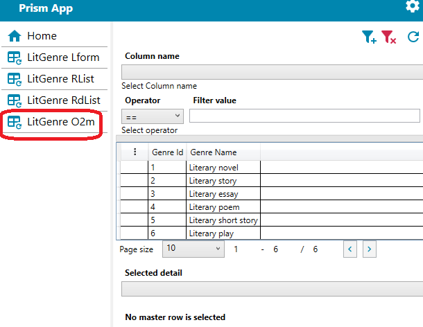


## Creating PrismModule project for Feature controls
1. Under "ClientProjects/Models"-folder create "Prism module (Wpf)" project. Name the project FeatureServicesPrismModule.

 

2. In the FeatureServicesPrismModule-project delete "ViewModels" and "Views" folders.
3. In the FeatureServicesPrismModuleModule.cs-file of FeatureServicesPrismModule-project remove "using FeatureServicesPrismModule.Views;"-line of code.
4. Add references onto CommonInterfacesClassLibrary, CommonWpfCustomControlLibrary, CommonWpfUserControlLibrary,

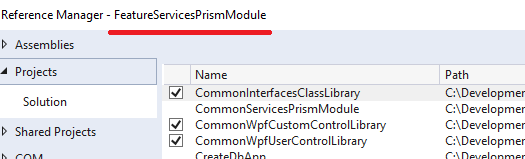 

5. Add "Literature\UserControls" folder under FeatureServicesPrismModule-project
6. Add "Literature\ViewModels" folder under FeatureServicesPrismModule-project
7. Modify App.config file of the PrismTestApp project as shown below
```xml
<?xml version="1.0" encoding="utf-8" ?>
<configuration>
  <configSections>
    <section name="modules" type="Prism.Modularity.ModulesConfigurationSection, Prism.Wpf"/>
  </configSections>
  <modules>
    <module assemblyFile="CommonServicesPrismModule.dll"
            moduleType="CommonServicesPrismModule.CommonServicesPrismModuleModule, CommonServicesPrismModule, Version=1.0.0.0, Culture=neutral, PublicKeyToken=null"
            moduleName="CommonServicesPrismModule" startupLoaded="true">
      <dependencies>
      </dependencies>
    </module>
    <module assemblyFile="ModelServicesPrismModule.dll"
            moduleType="ModelServicesPrismModule.ModelServicesPrismModuleModule, ModelServicesPrismModule, Version=1.0.0.0, Culture=neutral, PublicKeyToken=null"
            moduleName="ModelServicesPrismModule" startupLoaded="true">
      <dependencies>
        <dependency moduleName="CommonServicesPrismModule"/>
      </dependencies>
    </module>
    <module assemblyFile="FeatureServicesPrismModule.dll"
            moduleType="FeatureServicesPrismModule.FeatureServicesPrismModuleModule, FeatureServicesPrismModule, Version=1.0.0.0, Culture=neutral, PublicKeyToken=null"
            moduleName="FeatureServicesPrismModule" startupLoaded="true">
      <dependencies>
        <dependency moduleName="CommonServicesPrismModule"/>
        <dependency moduleName="ModelServicesPrismModule"/>
      </dependencies>
    </module>
  </modules>
</configuration>
```

## Creating Feature control for LitGenre

1. Right click "Literature\UserControls" folder under FeatureServicesPrismModule-project and select Feature Wizard. On the First page click Next Button

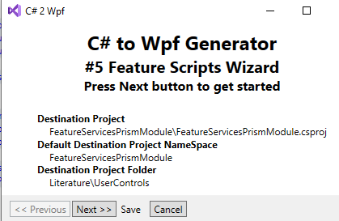 

2. On the second page select "DbContextClassLibrary"-project and "LitDbContext"-DbContext. click "Next"-button.

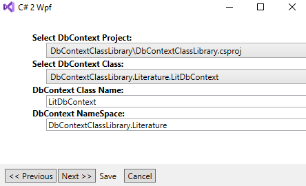 

3. On the third page click "add"-button

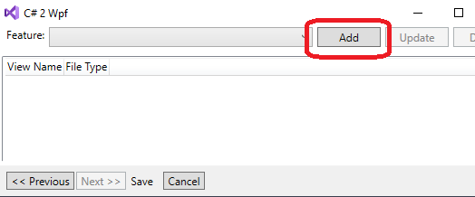 

4. In the dialog type "LitGenreFeature" name and check all four items in the list. Click "save"-button

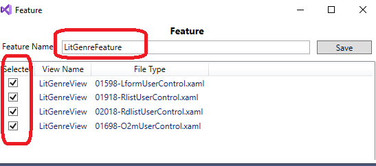 

5. On the third page select "LitGenreFeature" and click "Next"-button.

 

6. On the fourth page select "30100-FtrUserControl.xaml.cs" and click "Next"-button.

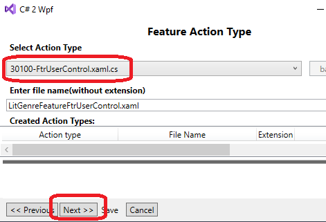 

7. On the fifth page select "FtrUserControl.xaml.cs.t4" and click "Next"-button.

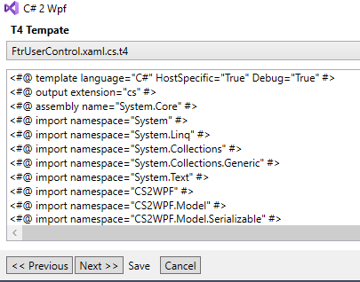 

8. On the sixth page click "Save" and click "Next"-button.

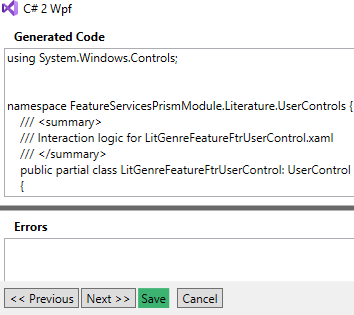 

9. For now you are on the third page again. Repeat Steps 5-8 for "30102-FtrUserControl.xaml"-type and "FtrUserControl.xaml.t4"-script

10. Close the Wizard.
11. Right click "Literature\ViewModels" folder under FeatureServicesPrismModule-project and select Feature Wizard. 
12. Repeat steps 2-8 for "30104-FtrViewModel.cs"-type and "FtrViewModel.cs.t4"-script. (Do not create Feature again. Just select existing from the combo.)

## Modify Prism IModule class for Feature
- Step 1: Open "Literature\ViewModels\LitGenreFeatureFtrViewModel.cs" file of "FeatureServicesPrismModule" project and follow the instructions
```java
/*
    "LitGenreFeatureFtrViewModel" UserControl is defined in the "FeatureServicesPrismModule"-project.
    In the file of IModule-class of "FeatureServicesPrismModule"-project the following line of code must be inserted:

        public void RegisterTypes(IContainerRegistry containerRegistry)
        {
            ...
            // According to requirements of the "LitGenreFeatureFtrViewModel.cs"-file of "FeatureServicesPrismModule"-project. 
            containerRegistry.RegisterForNavigation<LitGenreFeatureFtrUserControl, LitGenreFeatureFtrViewModel>("LitGenreFeatureFtrUserControl");
            ...
        }
*/
```
## Modify main menu of MainWindowViewModel and run app for Feature
- Step 1: Open "ViewModels\MainWindowViewModel.cs" file of "PrismTestApp" project and add "LitGenre Feature"-menu item.
```java
        IEnumerable<IWebServiceFilterMenuInterface> _MainMenu = new ObservableCollection<IWebServiceFilterMenuInterface>()
        {
            new WebServiceFilterMenuViewModel() { Id = "000", Caption="Home", IconName="Home",  IconColor="Primary", Data="HomeUserControl", Command=RoutedCommandExt.MainMenuCommand},
            new WebServiceFilterMenuViewModel() { Id = "001", Caption="LitGenre Lform", IconName="TableRefresh",  IconColor="Primary", Data="LitGenreViewLformUserControl", Command=RoutedCommandExt.MainMenuCommand},
            new WebServiceFilterMenuViewModel() { Id = "001", Caption="LitGenre RList", IconName="TableRefresh",  IconColor="Primary", Data="LitGenreViewRlistUserControl", Command=RoutedCommandExt.MainMenuCommand},
            new WebServiceFilterMenuViewModel() { Id = "001", Caption="LitGenre RdList", IconName="TableRefresh",  IconColor="Primary", Data="LitGenreViewRdlistUserControl", Command=RoutedCommandExt.MainMenuCommand},
            new WebServiceFilterMenuViewModel() { Id = "001", Caption="LitGenre O2m", IconName="TableRefresh",  IconColor="Primary", Data="LitGenreViewO2mUserControl", Command=RoutedCommandExt.MainMenuCommand},
            new WebServiceFilterMenuViewModel() { Id = "001", Caption="LitGenre Feature", IconName="TableRefresh",  IconColor="Primary", Data="LitGenreFeatureFtrUserControl", Command=RoutedCommandExt.MainMenuCommand},
        };
```
- Step 2: Rebuild "FeatureServicesPrismModule" project, 
- Step 3: Run DbWebApplication 
- Step 4: Run PrismTestApp
- Step 5: Click "LitGenre Feature"-navigation menu. Note, it is possible to expand and collapce any child window.

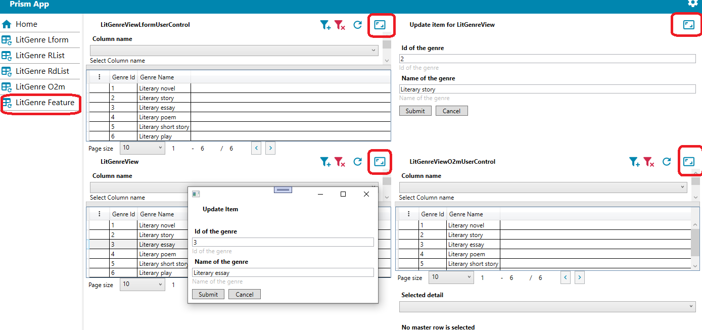


## Note about Authorization
- Authorization is turned off by default. 
Open AppGlblSettingsService.cs-file of the CommonServicesPrismModule-project and go to GetViewModelMask() and GetDashBrdMask()-methods. The first line of code turns off the Authorization. 
```java
        public int GetViewModelMask(string vwModel) {
            return 15; // delete this line when vwModels is ready
            if (Permissions == null) return 0;
            int pk = 0;
            if (!Views.TryGetValue(vwModel, out pk)) return 0;
            int rid = pk / 7;
            if (rid >= (Permissions.Count() - 3)) return 0;
            int sft = (pk - rid * 7) * 4;
            int  rslt = Permissions[rid];
            if (sft > 0)
            {
                rslt >>= sft;
            }
            return rslt;
        }
        public int GetDashBrdMask(string dshBrd)
        {
            return 1; // delete this line when dshBrds is ready
            if (Dashboards == null) return 0;
            int pk = 0;
            if (!Dashboards.TryGetValue(dshBrd, out pk)) return 0;
            int rid = pk / 31;
            if (rid >= (Permissions.Count() - 14)) return 0;
            int sft = (pk - rid * 31);
            int rslt = Permissions[rid + 14];
            if (sft > 0)
            {
                rslt >>= sft;
            }
            return rslt;
        }
```
But to remove the first line in both methods is not enough. 
At first, "Views" and "Dashboards" variables must be correctly defined in the same AppGlblSettingsService.cs-file of the CommonServicesPrismModule-project. The definition of htese two variables must be the same as in the database security tables.
```java
        Dictionary<string, int> Views = new Dictionary<string, int>()
        {
            { "LitAuthorView", 0 },
            { "LitBookView", 1 },
        };
        Dictionary<string, int> Dashboards = new Dictionary<string, int>()
        {
            { "ManuscriptDFeatureFtrComponent", 0 },
            { "ManuscriptRFeatureFtrComponent", 1 },
        };
```
At second, AppGlblSettingsService.cs-file defines _Permissions-variable.
Right after login the _Permissions-variable must be redefined with a permission bitmask for the given user.  
The "AspnetusermaskViewServicePermission.getcurrusermasks()"-must be called to obtain "Permissions"-vector for the given user.
Again, immediately after logging out of the system, the Permissions variable should be reset to its original state.
```java
        int[] _Permissions = new int[] { 0, 0, 0, 0, 0, 0, 0, 0, 0, 0, 0, 0, 0, 0, 0, 0, 0 };
```
        
Information about how to generate and setup Authorization for the server and client part of the app will be described in the Wiki of CS2WPF-project and in this readme.

Note 1: the developer should not manually populate data for Views and Dashboards vars. There is a special generator scripts for SQL-code (to populate Database tables) and C# code to be inserted in AppGlblSettingsService.cs-file. 

Note 2: It is not a good idea to hardcodde Views and Dashboards vars . Instead, OnLoaded()-method of MainWindowViewModel.cs file must be used to get data from the app settings file (it is one of the solution).

## Steps of adding Authorization to the application
The steps are the same as for adding regular Entities, Views, WebApi Services, user interface and Features using CS2WPF. 
An insignificant difference is that some WebApi services and some Entities have already been implemented in AspNet WebApi application. For instance, individual AspNet security includes Users and Roles.
CS2WPF includes generator scripts to create predefined Entities, Dbcontext. The developer does not need to manually define "UIforms" and "UIlists", but rather import the definition from a custom json file.

### Here's how to find such a json file.
At first, we have to find the folder of installed CS2WPF files. To do this run File explorer and type "%appdata%" and press Enter.

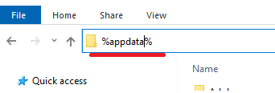

Then go to "%appdata%\local"

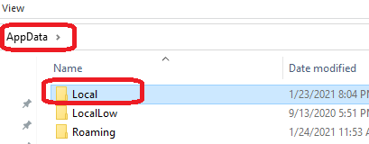

At the end open the folder "%appdata%\Local\Microsoft\VisualStudio\XXX\Extensions\YYY", where "XXX" and "YYY" are the names that were defined during the CS2WPF installation and may differ from those shown in the figure below. This is the folder where CS2WPF was installed.

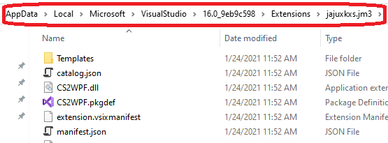

Inside the folder where CS2WPF  was installed open "Templates\ContextsToImport"-folder and copy "aspnetchckdbcontext.json"-file. Paste "aspnetchckdbcontext.json"-file to your desktop or another place, which will then be easy to navigate. "aspnetchckdbcontext.json"-file will be used to import View definitions.

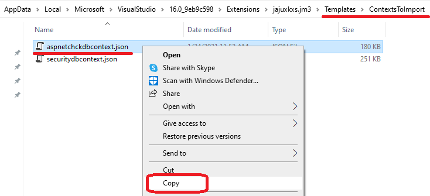

## Creating folders for Authorization files
We continue with a projects created above. Of course, you can name the projects as you like. It doesn't matter what the projects are named, the CS2WPF generators will work correctly. 

Create "AspNetMaskSecurity" subfolder inside DbContextClassLibrary, DbEntitiesClassLibrary, DbModelsClassLibrary projects. (Again, you can name subfolder as you like.)

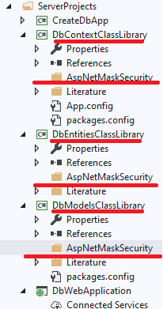

## Creating Entities for Authorization
- Step 1: Right click "AspNetMaskSecurity"-folder of DbEntitiesClassLibrary-project and select "Wpf form Wizard". 

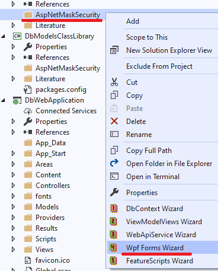

- Step 2: On the first page (invitation page) click "next"-button.
- Step 3: On the second page, select "DbContextClassLibrary"-project and "LitDbcontext"-Dbccontext and click next.

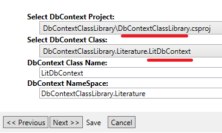

- Step 4: On the third page, select "==Context==" and click "Next"-button

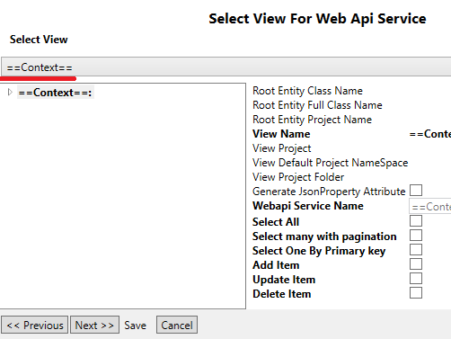

- Step 5: On the fourth page, click "patch processing"-button. "Batch action" dialog will be shown.

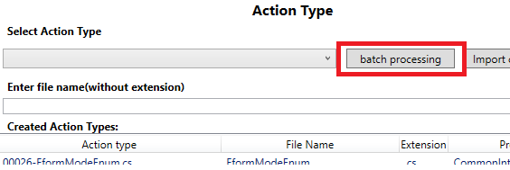

- Step 6: In "Batch action" dialog, select "00140-AspNetEntities.json"-script and click start-button. Make sure that "Errors"-panel is empty and close the Wizard.

## Creating Developer Edition of DbContext for Authorization
- Step 1: Right click "AspNetMaskSecurity"-folder of DbContextClassLibrary-project and select "Wpf form Wizard". 
- Repeat steps 2-5 of the [Creating Entities for  Authorization](#Creating-Entities-for-Authorization) paragraph
- Step 6: In "Batch action" dialog, select "00150-AspNetDbContextDev.json"-script and click start-button. Make sure that "Errors"-panel is empty and close the Wizard.

## Creating Views for Authorization
Note: The creation order of Views is important. Master entities first:
1. aspnetdashboard
2. aspnetmodel
3. aspnetrole [dummy(mock) class]
4. aspnetuser [dummy(mock) class]
5. aspnetrolemask
6. aspnetusermask [dummy(mock) class]
7. aspnetuserroles [dummy(mock) class]

- Step 1: Right click "AspNetMaskSecurity"-folder of DbModelsClassLibrary-project and select "ViewModelViews Wizard". 

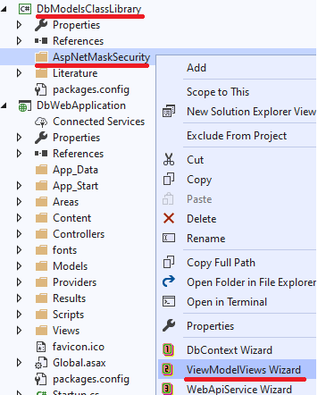

- Step 2: On the first page (invitation page) click "next"-button.
- Step 3: On the second page, select "DbContextClassLibrary"-project and "aspnetchckdbcontext"-Dbccontext and click next.

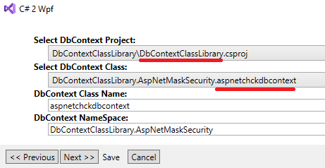

- Step 4: On the third page, select "DbEntitiesClassLibrary"-project and "aspnetdashboard"-entity and click "Next"-button

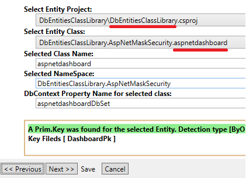

- Step 5: On the fifth page, click "Import"-button. "File open" dialog will be shown. Select the "aspnetchckdbcontext.json". 
How to find aspnetchckdbcontext.json-file was described in ["Steps of adding Authorization to the  application"](#Steps-of-adding-Authorization-to-the-application)-paragraph.

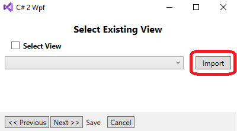

- Step 6: On the same fifth page, select "aspnetdashboardView", check "Select View" and click "Next"-button.

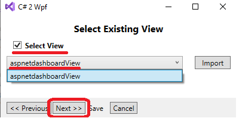

- Step 7: On the sixth page, expand "Properties"-node to make sure that all setting are the same as it is shown below. Click "next"-button.

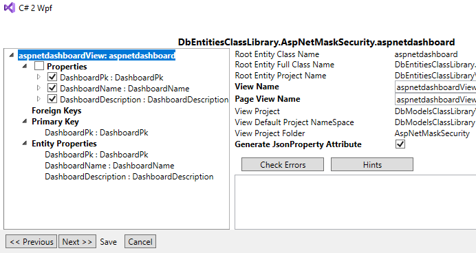

- Step 8: On the seventh page, select "ViewModel.cs.t4"-script and click "Next"-button.

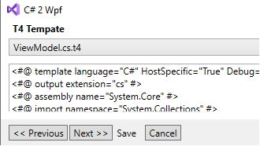

- Step 8: On the eighth page, click "Save"-button and then click "Next"-button.
- Step 9: On the nineth page, select "ViewModelPage.cs.t4"-script and click "Next"-button.

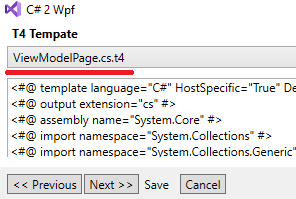

- Step 10: On the tenth page, click "Save"-button. Two new files have been created for the DbModelsClassLibrary-project. DO NOT CLOSE THE WIZARD. Click "Next"-button.


- Step 11: We are on the third page again. select "DbEntitiesClassLibrary"-project and "aspnetmodel"-entity and click "Next"-button.
- Step 12: Repeat steps 5-11 for the "aspnetmodel"-entity. Two new files have been created for the DbModelsClassLibrary-project. DO NOT CLOSE THE WIZARD. Click "Next"-button.
- Step 13: We are on the third page again. select "DbEntitiesClassLibrary"-project and "aspnetrole"-entity and click "Next"-button.
- Step 14: Repeat steps 5-11 for the "aspnetrole"-entity. Two new files have been created for the DbModelsClassLibrary-project. DO NOT CLOSE THE WIZARD. Click "Next"-button.
- Step 15: We are on the third page again. select "DbEntitiesClassLibrary"-project and "aspnetuser"-entity and click "Next"-button.
- Step 16: Repeat steps 5-11 for the "aspnetuser"-entity. Two new files have been created for the DbModelsClassLibrary-project. DO NOT CLOSE THE WIZARD. Click "Next"-button.
- Step 17: We are on the third page again. select "DbEntitiesClassLibrary"-project and "aspnetrolemask"-entity and click "Next"-button.
- Step 18: Repeat steps 5-11 for the "aspnetrolemask"-entity. Two new files have been created for the DbModelsClassLibrary-project. DO NOT CLOSE THE WIZARD. Click "Next"-button.
- Step 19: We are on the third page again. select "DbEntitiesClassLibrary"-project and "aspnetusermask"-entity and click "Next"-button.
- Step 20: Repeat steps 5-11 for the "aspnetusermask"-entity. Two new files have been created for the DbModelsClassLibrary-project. DO NOT CLOSE THE WIZARD. Click "Next"-button.
- Step 21: We are on the third page again. select "DbEntitiesClassLibrary"-project and "aspnetuserroles"-entity and click "Next"-button.
- Step 22: Repeat steps 5-11 for the "aspnetuserroles"-entity. Two new files have been created for the DbModelsClassLibrary-project. CLOSE THE WIZARD.

## Creating Production Edition of DbContext for Authorization
Note: The developper edition is required ONLY for generating Views. After the Views are ready the developer should generate production Edition. The production Edition does not include roles, users entities, since they have already been created under AspNet WebApi application.
- Step 1: Right click "AspNetMaskSecurity"-folder of DbContextClassLibrary-project and select "Wpf form Wizard". 
- Repeat steps 2-5 of the [Creating Entities for  Authorization](#Creating-Entities-for-Authorization) paragraph
- Step 6: In "Batch action" dialog, select "00160-AspNetDbContextProd.json"-script and click start-button. Make sure that "Errors"-panel is empty and close the Wizard.

## Adding ApplicationRoleManager for Authorization
Open the "App_Start\IdentityConfig.cs"-file of DbWebApplication-project. Insert the code below right after definition of the "ApplicationUserManager"-class:

```java
public class ApplicationRoleManager : RoleManager<IdentityRole>
{
        public ApplicationRoleManager(IRoleStore<IdentityRole, string> roleStore) : base(roleStore)
        {
        }

        public static ApplicationRoleManager Create(IdentityFactoryOptions<ApplicationRoleManager> options, IOwinContext context)
        {
        ///It is based on the same context as the ApplicationUserManager
            var appRoleManager = 
                new ApplicationRoleManager(new RoleStore<IdentityRole> (context.Get<ApplicationDbContext> ()));
            return appRoleManager;
        }
}
```

## Creating OwinContext for ApplicationRoleManager 
Open the "App_Start\Startup.Auth.cs"-file of DbWebApplication-project. Go to "ConfigureAuth(IAppBuilder app)"-method and insert the line of code as it is shown below:
```java
        public void ConfigureAuth(IAppBuilder app)
        {
            // Configure the db context and user manager to use a single instance per request
            app.CreatePerOwinContext(ApplicationDbContext.Create);
            app.CreatePerOwinContext<ApplicationUserManager>(ApplicationUserManager.Create);
            ////// begin insertion
            app.CreatePerOwinContext<ApplicationRoleManager>(ApplicationRoleManager.Create);
            ////// end insertion
```

## Creating WebApi services for Authorization
Note: The developer does not need to generate WebApi services for each Authorization entity. This is because some of these services are already included as part of the Asp Net application.
- Step 1: Right Click Controllers-folder of the DbWebApplication-project and select "WebApiService Wizard".


- Step 2: On the first (invitation) page click "Next"-button
- Step 3: On the second page, select "DbContextClassLibrary"-project and "aspnetchckdbcontext"-Dbccontext and click next.


- Step 4: On the third page, select "aspnetdashboardView". Expand "Properties"-node to make sure that all settings are the same as it is shown below. 
The settings for the Web Api service were imported when the developer imported the definitions for the views. (See [Creating Views for  Authorization](#Creating-Views-for-Authorization)). Click "Next"-button.


- Step 5: On the fourth page, select "DefaultWebApiService.cs.t4"-script and click "Next"-button


- Step 6: On the fifth page, click "save"-button. DO NOT CLOSE THE WIZARD. Click "Next"-button.
- Step 7: We are on the third page again. select "aspnetmodelView" and repeat steps 5-6. DO NOT CLOSE THE WIZARD. Click "Next"-button.
- Step 8: We are on the third page again. select "aspnetrolemaskView" and repeat steps 5-6. DO NOT CLOSE THE WIZARD. Click "Next"-button.
- Step 9: We are on the third page again. select "aspnetroleView" and repeat steps 5-6.  IMPORTANT: select "WebApiAspNetRoleService.cs.t4" in step 5. DO NOT CLOSE THE WIZARD. Click "Next"-button.
- Step 10: We are on the third page again. select "aspnetuserView" and repeat steps 5-6.  IMPORTANT: select "WebApiAspNetUserService.cs.t4" in step 5. DO NOT CLOSE THE WIZARD. Click "Next"-button.
- Step 11: We are on the third page again. select "aspnetuserrolesView" and repeat steps 5-6.  IMPORTANT: select "WebApiAspNetUserRoles.cs.t4" in step 5. DO NOT CLOSE THE WIZARD. Click "Next"-button.
- Step 12: We are on the third page again. select "aspnetusermaskView" and repeat steps 5-6.  IMPORTANT: select "WebApiAspNetUserMasksService.cs.t4" in step 5. CLOSE THE WIZARD.

Note: Compile DbWebApplication-project and add "using"-operator to some of the generated files. Errors of compiler output give the hints.

## Creating tables for Authorization
Under [Creating LiteratureTest Database on the server  side](#Creating-LiteratureTest-Database-on-the-server-side) we created small console app.
- Step 1: Add "DefaultConnection" to the "App.config"-file of the console app. Just copy it from Web.config-file of DbWebApplication.
```xml
...
  <configSections>
        <!-- For more information on Entity Framework configuration, visit http://go.microsoft.com/fwlink/?LinkID=237468 -->
        <section name="entityFramework"
          type="System.Data.Entity.Internal.ConfigFile.EntityFrameworkSection, EntityFramework, Version=6.0.0.0, Culture=neutral, PublicKeyToken=b77a5c561934e089"
          requirePermission="false"/>
  </configSections>
...  
  <connectionStrings>
    <add name="LiteratureTestConnection"
        connectionString="Data Source=SVR2016SQL2017;Initial Catalog=LiteratureTestCatalog;Persist Security Info=True;User ID=sa;Password=sa_PASSWORD_HERE"
        providerName="System.Data.SqlClient" />
    <add name="DefaultConnection" 
        connectionString="Data Source=SVR2016SQL2017;Initial Catalog=AspNetDbWebApplicationSecurity;Persist Security Info=True;User ID=sa;Password=sa_PASSWORD_HERE" 
        providerName="System.Data.SqlClient" />
  </connectionStrings>
...  
  <startup> 
        <supportedRuntime version="v4.0" sku=".NETFramework,Version=v4.7.2"/>
    </startup>
    <entityFramework>
        <providers>
            <provider invariantName="System.Data.SqlClient" type="System.Data.Entity.SqlServer.SqlProviderServices, EntityFramework.SqlServer"/>
        </providers>
    </entityFramework>
...  
```
- step 2: In the main method of the Console application write the code as below

        static void Main(string[] args)
        {
            Database.SetInitializer(new DropCreateDatabaseAlways<LitDbContext>());
            aspnetchckdbcontext db = new aspnetchckdbcontext();
            db.aspnetmodellDbSet.FirstOrDefault();
            Database.SetInitializer(new CreateDatabaseIfNotExists<LitDbContext>());
        }
- step 3: Save, build and run Console application.
- step 4: Open MS SQL Management studion and check that three tables have been added to "AspNetDbWebApplicationSecurity"-database:
    - dbo.aspnetdashboards
    - dbo.aspnetmodels
    - dbo.aspnetrolemasks


## Creating client interfaces for Authorization
- Step 1: Create "Interfaces\asp"-folder under "CommonInterfacesClassLibrary"-project.
- Step 2: Right click "Interfaces\asp"-folder of "CommonInterfacesClassLibrary"-project and select "Wpf form Wizard"-menu item.
- Step 3: On the first page click "Next"-button
- Step 4: On the second page, select "DbContextClassLibrary"-project and "aspnetchckdbcontext"-Dbccontext and click next.
- Step 5: On the third page, select "aspnetdashboardView" and click next.
- Step 6: On the fourth page, click "batch processing".
- Step 7:
    - Select "14210-AspNetAllInterfacesBatch.json"-item
    - Click "Start"-button
    - After generation finished make sure that "Error"-panel is empty
    - Close Wizard's dialogs
    - Rebuild "CommonInterfacesClassLibrary"-project

## Creating client Views for Authorization
- Step 1: Right click root node of "CommonServicesPrismModule"-project and select "Wpf form Wizard"-menu item.
- Step 2: On the first page click "Next"-button
- Step 3: On the second page, select "DbContextClassLibrary"-project and "aspnetchckdbcontext"-Dbccontext and click next.
- Step 4: On the third page, select "aspnetdashboardView" and click next.
- Step 5: On the fourth page, click "batch processing".
- Step 6:
    - Select "14220-AspNetAllModelsBatch.json"-item
    - Click "Start"-button
    - After generation finished make sure that "Error"-panel is empty
    - Close Wizard's dialogs
    - Rebuild "CommonServicesPrismModule"-project

## Import Common staff and creating client Services for Authorization
- Step 1: Right click root node of "CommonServicesPrismModule"-project and select "Wpf form Wizard"-menu item.
- Step 2: On the first page click "Next"-button
- Step 3: On the second page, select "DbContextClassLibrary"-project and "aspnetchckdbcontext"-Dbccontext and click next.
- Step 4: On the third page, select "aspnetdashboardView" and click next.
- Step 5: On the fourth page, click "Import common staff"-button.
- Step 6: With "Open file dialog" select "DbContextClassLibrary.DbContextClassLibrary.csproj.DbContextClassLibrary.Literature.LitDbContext.json".
- Step 7: On the fourth page, click "batch processing".
- Step 8:
    - Select "14230-AspNetAllServicesBatch.json"-item
    - Click "Start"-button
    - After generation finished make sure that "Error"-panel is empty
    - Close Wizard's dialogs
    - Rebuild "CommonServicesPrismModule"-project
- Step 9: Open each file in the "services\asp"-folder and follow the instruction at the beginign of this file.


- For instance, aspnetdashboardViewService.cs recommends to insert one line of code into "RegisterTypes()"-method of "CommonServicesPrismModuleModule.cs"-file


- As a result, the following lines of code were added in "RegisterTypes()"-method of "CommonServicesPrismModuleModule.cs"-file
```java
            containerRegistry.Register<IAspnetdashboardViewService, AspnetdashboardViewService>();
            containerRegistry.Register<IAspnetdashboardViewServiceCopyPermission, AspnetdashboardViewServiceCopyPermission>();
            containerRegistry.Register<IAspnetmodelViewService, AspnetmodelViewService>();
            containerRegistry.Register<IAspnetmodelViewServiceCopyPermission, AspnetmodelViewServiceCopyPermission>();
            containerRegistry.Register<IAspnetrolemaskViewService, AspnetrolemaskViewService>();
            containerRegistry.Register<IAspnetroleViewService, AspnetroleViewService>();
            containerRegistry.Register<IAspnetusermaskViewService, AspnetusermaskViewService>();
            containerRegistry.Register<IAspnetusermaskViewServicePermission, AspnetusermaskViewServicePermission>();
            containerRegistry.Register<IAspnetuserrolesViewService, AspnetuserrolesViewService>();
            containerRegistry.Register<IAspnetuserViewService, AspnetuserViewService>();
```

## Creating Sforms for Authorization
- Step 1: Right click root node of "CommonServicesPrismModule"-project and select "Wpf form Wizard"-menu item.
- Step 2: On the first page click "Next"-button
- Step 3: On the second page, select "DbContextClassLibrary"-project and "aspnetchckdbcontext"-Dbccontext and click next.
- Step 4: On the third page, select "aspnetdashboardView" and click next.
- Step 5: On the fourth page, click "batch processing".
- Step 6:
    - Select "14240-AspNetAllSformsBatch.json"-item
    - Click "Start"-button
    - After generation finished make sure that "Error"-panel is empty
    - Close Wizard's dialogs
    - Rebuild "CommonServicesPrismModule"-project
- Step 7: Open each file in the "ViewModels\asp"-folder and follow the instruction at the beginign of this file.


- For instance, aspnetdashboardViewSformViewModel.cs recommends to insert two lines of code into "RegisterTypes()"-method of "CommonServicesPrismModuleModule.cs"-file


- Note: not all recommended registrations should be added to the "CommonServicesPrismModuleModule.cs"-file. Only "RegisterDialog"-lines are required for Sforms-types.

## Creating Eforms for Authorization
- Step 1: Right click root node of "CommonServicesPrismModule"-project and select "Wpf form Wizard"-menu item.
- Step 2: On the first page click "Next"-button
- Step 3: On the second page, select "DbContextClassLibrary"-project and "aspnetchckdbcontext"-Dbccontext and click next.
- Step 4: On the third page, select "aspnetdashboardView" and click next.
- Step 5: On the fourth page, click "batch processing".
- Step 6:
    - Select "14250-AspNetAllEformsBatch.json"-item
    - Click "Start"-button
    - After generation finished make sure that "Error"-panel is empty
    - Close Wizard's dialogs
    - Rebuild "CommonServicesPrismModule"-project
- Step 7: Open each file in the "ViewModels\asp"-folder and follow the instruction at the beginign of this file.

## Creating Lforms for Authorization
- Step 1: Right click root node of "CommonServicesPrismModule"-project and select "Wpf form Wizard"-menu item.
- Step 2: On the first page click "Next"-button
- Step 3: On the second page, select "DbContextClassLibrary"-project and "aspnetchckdbcontext"-Dbccontext and click next.
- Step 4: On the third page, select "aspnetdashboardView" and click next.
- Step 5: On the fourth page, click "batch processing".
- Step 6:
    - Select "14260-AspNetAllLformsBatch.json"-item
    - Click "Start"-button
    - After generation finished make sure that "Error"-panel is empty
    - Close Wizard's dialogs
    - Rebuild "CommonServicesPrismModule"-project
- Step 7: Open each file in the "ViewModels\asp"-folder and follow the instruction at the beginign of this file.

## Creating O2m and O2mMask for Authorization
- Step 1: Right click root node of "CommonServicesPrismModule"-project and select "Wpf form Wizard"-menu item.
- Step 2: On the first page click "Next"-button
- Step 3: On the second page, select "DbContextClassLibrary"-project and "aspnetchckdbcontext"-Dbccontext and click next.
- Step 4: On the third page, select "aspnetdashboardView" and click next.
- Step 5: On the fourth page, click "batch processing".
- Step 6:
    - Select "14270-AspNetAllO2mMaskBatch.json"-item
    - Click "Start"-button
    - After generation finished make sure that "Error"-panel is empty
    - Close Wizard's dialogs
    - Rebuild "CommonServicesPrismModule"-project
- Step 7: Open each file in the "ViewModels\asp"-folder and follow the instruction at the beginign of this file.


## Creating Feature for Authorization
- Preliminary Step 1: Create Features-folder under "UserControls\asp"-folder of "CommonServicesPrismModule"-project
- Preliminary Step 2: Create Features-folder under "ViewModels\asp"-folder of "CommonServicesPrismModule"-project

###  Creating SecurityLformsFeature
- Step 1: Right click "UserControls\asp\Features"-folder of "CommonServicesPrismModule"-project and select "FeatureScripts Wizard"-menu item
- Step 2: On the first (invitation) page, click "Next"-button
- Step 3: On the second page, select "DbContextClassLibrary"-project and "aspnetchckdbcontext"-Dbccontext and click next. 
- Step 4: On the third page, click "Add"-button. "Feature"-dialog will be shown.
- Step 5: In the "Feature"-dialog enter "SecurityLformsFeature"-name for the feature and check the following items and click "Save"-button
    - aspnetdashboardView (01598-LformUserControl.xaml)
    - aspnetmodelView (01598-LformUserControl.xaml)
    - aspnetroleView (01598-LformUserControl.xaml)
    - aspnetuserView (01598-LformUserControl.xaml)
    - aspnetrolemaskView (01598-LformUserControl.xaml)
    


- Step 6: On the third page, select "SecurityLformsFeature" and click "Next"-button.


- Step 7: On the fourth page, select "30100-FtrUserControl.xaml.cs" and click "Next"-button.


- Step 8: On the fifth page, select "FtrUserControl.xaml.cs.t4" and click "Next"-button.


- Step 9: On the sixth page, click "save"-button and click "Next"-button.


- Step 10: You are on the third page again, click "Next"-button.
- Step 11: On the fourth page, select "30102-FtrUserControl.xaml" and click "Next"-button.
- Step 12: On the fifth page, select "FtrUserControl.xaml.t4" and click "Next"-button.
- Step 13: On the sixth page, click "save"-button and close the Wizard.
- Step 14: Right click "ViewModels\asp\Features"-folder of "CommonServicesPrismModule"-project and select "FeatureScripts Wizard"-menu item
- Step 15: On the first (invitation) page, click "Next"-button
- Step 16: On the second page, select "DbContextClassLibrary"-project and "aspnetchckdbcontext"-Dbccontext and click next. 
- Step 17: On the third page, select "SecurityLformsFeature" and click "Next"-button.
- Step 18: On the fourth page, select "30104-FtrViewModel.cs" and click "Next"-button.
- Step 19: On the fifth page, select "FtrViewModel.cs.t4" and click "Next"-button.
- Step 20: On the sixth page, click "save"-button and close the Wizard.
- Step 21: Open "ViewModels\asp\Features\SecurityLformsFeatureFtrViewModel.cs"-file and follow the instructions:

```java
/*
    "SecurityLformsFeatureFtrViewModel" UserControl is defined in the "CommonServicesPrismModule"-project.
    In the file of IModule-class of "CommonServicesPrismModule"-project the following line of code must be inserted:
        public void RegisterTypes(IContainerRegistry containerRegistry)
        {
            ...
            // According to requirements of the "SecurityLformsFeatureFtrViewModel.cs"-file of "CommonServicesPrismModule"-project. 
            containerRegistry.RegisterForNavigation<SecurityLformsFeatureFtrUserControl, SecurityLformsFeatureFtrViewModel>("SecurityLformsFeatureFtrUserControl");
            ...
        }
*/        
```

###  Creating SecurityO2msFeature
- Repeat steps 1-21 of [Creating  SecurityLformsFeature](#Creating-SecurityLformsFeature)
- At Step 5: In the "Feature"-dialog enter "SecurityO2msFeature"-name for the feature and check the following items and click "Save"-button
    - aspnetroleView (02122-O2mMaskUserControl.xaml)
    - aspnetuserView (01698-O2mUserControl.xaml)
    - aspnetuserView (02122-O2mMaskUserControl.xaml)


- At Step 6 select "SecurityO2msFeature"
- At Step 17 select "SecurityO2msFeature"
- At Step 21 Open "ViewModels\asp\Features\SecurityO2msFeatureFtrViewModel.cs"-file

## Modify main menu for Features of Authorization
Open "MainWindowViewModel.cs" of "PrismTestApp"-project and modify "_MainMenu". Add two lines:
```java
    new WebServiceFilterMenuViewModel() { Id = "001", Caption="Security Lforms Feature", IconName="TableRefresh",  IconColor="Primary", Data="SecurityLformsFeatureFtrUserControl", Command=RoutedCommandExt.MainMenuCommand},
    new WebServiceFilterMenuViewModel() { Id = "001", Caption="Security O2ms Feature", IconName="TableRefresh",  IconColor="Primary", Data="SecurityO2msFeatureFtrUserControl", Command=RoutedCommandExt.MainMenuCommand},
```

## Test Features of Authorization
- Run DbWebApplication
- Rebuild and Run PrismTestApp
- Click "Security Lforms Feature"-navigation menu. The result is shown on the slide below


- Click "Security O2ms Feature"-navigation menu. The result is shown on the slide below


## Populate data for Authorization
Open "Shared/CommonServicesPrismModule/AppGlblSettingsSrvc/AppGlblSettingsService.cs"-file of CommonServicesPrismModule-project and find definitions for "Views" and "Dashboards". 
Both vars should be populated with a correct data. At second, the same data should be inserted into Authorization database tables. 
It's possible to make it manually with Authorization Features UI and manually define "Views" and "Dashboards" vars. But it's easy to mistype and it's time consuming. 
Four dedicated scripts can help a developer get the job done.

### Populate Views and Features data for aspnetchckdbcontext
We have two DbContexts "aspnetchckdbcontext" and “LitDbContext”. Each has its own set of Views and Features. As a result, the developer needs to run scripts for both DbContexts.

We start with "aspnetchckdbcontext"
- Step 1: Right click any project and select "FeatureScripts Wizard"-menu item
- Step 2: On the first (invitation) page, click "Next"-button
- Step 3: On the second page, select "DbContextClassLibrary"-project and "aspnetchckdbcontext"-Dbccontext and  click next. 
- Step 4: On the third page, select any feature (for instance, "SecurityLformsFeature") and click "Next"-button. (When you select a feature, the "Next" button becomes available)
- Step 5: On the fourth page, select "30180-AllModelViews.sql" and click "Next"-button.
- Step 6: On the fifth page, select "AllModelViews.sql.t4". Leave "startFromId"-variable to be equal to 0!!! Click "Next"-button.

    

- Step 6: On the sixth page, copy Sql-code into the clipboard. Remember the last Id which is equal to 6.
```sql
/*
USE [AspNetSecurityDataBase]
GO
*/
    insert into [dbo].[aspnetmodels]([ModelPk], [ModelName], [ModelDescription]) values ( 0, 'aspnetdashboardView', 'Description for aspnetdashboardView')
    go

    insert into [dbo].[aspnetmodels]([ModelPk], [ModelName], [ModelDescription]) values ( 1, 'aspnetmodelView', 'Description for aspnetmodelView')
    go

    insert into [dbo].[aspnetmodels]([ModelPk], [ModelName], [ModelDescription]) values ( 2, 'aspnetroleView', 'Description for aspnetroleView')
    go

    insert into [dbo].[aspnetmodels]([ModelPk], [ModelName], [ModelDescription]) values ( 3, 'aspnetuserView', 'Description for aspnetuserView')
    go

    insert into [dbo].[aspnetmodels]([ModelPk], [ModelName], [ModelDescription]) values ( 4, 'aspnetrolemaskView', 'Description for aspnetrolemaskView')
    go

    insert into [dbo].[aspnetmodels]([ModelPk], [ModelName], [ModelDescription]) values ( 5, 'aspnetusermaskView', 'Description for aspnetusermaskView')
    go

    insert into [dbo].[aspnetmodels]([ModelPk], [ModelName], [ModelDescription]) values ( 6, 'aspnetuserrolesView', 'Description for aspnetuserrolesView')
    go
```
- Step 7: Run "SQL Server Management Studio" and execute Sql-code against "AspNetDbWebApplicationSecurity"-database. this name is taken from the Web.config file.
- Step 8: On the sixth page, click "Next"-button.
- Step 9: You are on the third page again. Repeat steps 4-8.
    - In Step 5 select "30190-AllDashBoards.sql"
    - In Step 6 select "AllDashBoards.sql.t4". Remember the last Id which is equal to 1.
```sql
/*
USE [AspNetSecurityDataBase]
GO
*/
    insert into [dbo].[aspnetdashboards]([DashboardPk], [DashboardName], [DashboardDescription]) values ( 0, 'SecurityLformsFeatureFtrUserControl', 'Description for SecurityLformsFeatureFtrUserControl')
    go

    insert into [dbo].[aspnetdashboards]([DashboardPk], [DashboardName], [DashboardDescription]) values ( 1, 'SecurityO2msFeatureFtrUserControl', 'Description for SecurityO2msFeatureFtrUserControl')
    go
```

- Step 10: You are on the third page again. Repeat steps 4-8.
    - In Step 5 select "30185-AllModelViews.cs"
    - In Step 6 select "AllModelViews.cs.t4". Remember the last Id which is equal to 6. With a code below we redefine "Views"-var.
```java    
     {"aspnetdashboardView", 0 },
     {"aspnetmodelView", 1 },
     {"aspnetroleView", 2 },
     {"aspnetuserView", 3 },
     {"aspnetrolemaskView", 4 },
     {"aspnetusermaskView", 5 },
     {"aspnetuserrolesView", 6 },
```

- Step 11: You are on the third page again. Repeat steps 4-8.
    - In Step 5 select "30195-AllDashBoards.cs"
    - In Step 6 select "AllDashBoards.cs.t4". Remember the last Id which is equal to 6. With a code below we redefine "Dashboards" var.
```java    
    {"SecurityLformsFeatureFtrUserControl", 0},
    {"SecurityO2msFeatureFtrUserControl", 1},
```

### Populate Views and Features data for "LitDbContext"
To populate data for "LitDbContext" the developer should follow the steps described under [Populare Views and Features data for  aspnetchckdbcontext](#Populare-Views-and-Features-data-for-aspnetchckdbcontext).
- In Step 3 we select "DbContextClassLibrary"-project and "LitDbContext"-Dbccontext
- Right before executing "30180-AllModelViews.sql" and "30185-AllModelViews.cs"-scripts we should reset startFromId"-var to 7.

   

- Right before executing "AllDashBoards.sql.t4" and "30195-AllDashBoards.cs"-scripts we should reset startFromId"-var to 2.

   

- Additional data for "Views"-var:
```java    
     {"LitGenreView", 7 },
```
- Additional data for "Dashboards"-var:
```java    
    {"LitGenreFeatureFtrUserControl", 2},
```
### Testing the results of data population
- Run DbWebApplication
- Rebuild and Run PrismTestApp
- Click "Security Lforms Feature"-navigation menu. The result is shown on the slide below


## Add Roles to application
For now we are ready to add/modify/delete roles for the  application.
- Click "Security Lforms Feature"-menu item
- "AspnetroleViewLformUserControl"-child window gives this opportunity


## Assign roles to user
For now we are ready to Assign(Remove) roles to user.
- Click "Security Lforms Feature"-menu item
- "AspnetuserViewO2mUserControl"-child window gives this opportunity


## Add bitmask rows for roles
Selecting master rows in "AspnetroleViewO2mMaskUserControl"-controls does not changed the detail panel. This is because "dbo.aspnetrolemasks"-table is empty.


- Navigate to "Security Lforms Feature"
- With AspnetrolemaskViewLformUserControl add one row for each Role.


Selecting master rows in "AspnetroleViewO2mMaskUserControl"-controls shows the detail panel. 


## View user permissions
After configuring permissions for roles and assigning roles to users, you can view user permissions, which is READ ONLY.
- "AspnetuserViewO2mMaskUserControl"-child window gives this opportunity


## Turn on Authorization
- Step 1: Open "AppGlblSettingsService.cs"-file of CommonServicesPrismModule-project. Comment (or delete) the first line in the body of GetViewModelMask() and GetDashBrdMask() methods.
```java    
        public int GetViewModelMask(string vwModel) {
            //return 15; // delete this line when vwModels is ready
        ...
        public int GetDashBrdMask(string dshBrd) {
            //return 1; // delete this line when dshBrds is ready
```

- Step 2: Open MainWindowViewModel.cs-file of PrismTestApp-project. Uncomment the code in the body of OnUserChangedNotification() method:
```java    
        /* Uncomment to turn ON Authorization
         
        IAspnetusermaskViewServicePermission ServicePermission = null;
        */
        protected void OnUserChangedNotification(object sender, string uname) {
            UserName = uname;
            /* Uncomment to turn ON Authorization
            if (string.IsNullOrEmpty(uname))
            {
                GlblSettingsSrv.Permissions = GlblSettingsSrv.GetEmptyPermissions();
            } else
            {
                if(ServicePermission == null)
                {
                    ServicePermission = _containerProvider.Resolve<IAspnetusermaskViewServicePermission>();
                }
                Application.Current.Dispatcher.Invoke(async () =>
                {
                    IaspnetusermaskViewPage rslt = await ServicePermission.getcurrusermasks();
                    GlblSettingsSrv.Permissions = ServicePermission.src2array(rslt);
                });
            }
            */
        }
```
- Here is a result:


- And after login:


- But admin does not have permission for "LitGenre"


- Note: Only navigation awair user control and Features support authorization.

